# SAYFE

> **모두의 안전을, 각자의 언어로.**  
> **Edge AI 기반 건설현장 실시간 다국어 안전소통 및 위험대응 시스템**

SAYFE는 건설현장에서 외국인 근로자가 **언어 장벽과 현장 은어·전문용어 때문에 안전정보를 놓치지 않도록**, 관리자의 한국어 안전지시를 현장 문맥에 맞게 처리하여 한국어·중국어·베트남어로 전달하고, Vision AI와 Gas Sensor를 이용해 위험상황을 자동 감지하여 실제 안전장치 제어까지 연결하는 **Edge AI 기반 통합 안전 시스템**입니다.

본 프로젝트는 **제24회 임베디드 소프트웨어 경진대회 자유공모 부문 출품작**입니다.

- Team: **SAYFE**
- University: **한성대학교**
- Repository: https://github.com/kyb110811/2026ESWContest_free_SAYFE

---

# 1. 프로젝트 개요

건설현장은 작업자와 중장비가 동시에 움직이고 추락, 협착, 충돌, 가스 노출 등 다양한 위험이 발생하는 고위험 작업환경입니다.

특히 외국인 근로자는 언어 장벽뿐 아니라 `공구리`, `나라시`, `아시바`, `가네`처럼 실제 건설현장에서 사용하는 은어·전문용어 때문에 관리자의 작업지시와 안전정보를 정확히 이해하기 어려울 수 있습니다.

또한 작업자와 중장비의 근접이나 가스 위험처럼 즉각적인 대응이 필요한 상황에서는 일반적인 STT → 번역 → TTS 처리 과정만으로는 긴급 경고 전달이 늦어질 수 있습니다.

SAYFE는 이러한 문제를 해결하기 위해 다음 기능을 하나의 시스템으로 통합했습니다.

1. **관리자 한국어 음성의 실시간 인식·보정·다국어 변환**
2. **건설현장 은어·전문용어 정규화**
3. **Auracast 기반 언어별 안전방송 송출**
4. **Vision AI 기반 작업자·중장비 위험상황 자동 감지**
5. **ESP32-C3 + Gas Sensor 기반 환경 위험 감지**
6. **Bluetooth 기반 위험 이벤트 전달**
7. **Raspberry Pi GPIO 기반 물리 장치 제어**
8. **Web UI 기반 방송 제어 및 방송·처리 이력 관리**

---

# 2. 개발 배경

## 2.1 외국인 근로자의 증가와 다국어 안전소통

건설현장에서는 다양한 국적의 외국인 근로자가 근무하고 있으며, 언어 장벽으로 인해 작업지시와 안전수칙 전달에 어려움이 발생할 수 있습니다.

특히 위험상황에서는 근로자가 직접 QR 코드를 확인하거나 번역문을 찾아보는 방식보다 **즉시 이해할 수 있는 음성 기반 안전정보 전달**이 필요합니다.

---

## 2.2 기존 방식의 한계

기존 QR 기반 번역 방식은 사용자가 직접 QR을 촬영하고 번역된 텍스트를 확인해야 합니다.

따라서 다음과 같은 상황에서는 즉각적인 대응이 어렵습니다.

- 이동 중인 작업자
- 양손 작업 중인 근로자
- 중장비 접근과 같은 긴급 위험 상황
- 가스 누출 등 즉시 대피가 필요한 상황

SAYFE는 이러한 한계를 보완하기 위해 **음성·영상·환경센서·무선통신·물리제어를 하나의 Edge AI 시스템으로 통합**했습니다.

---

# 3. 개발 목표

## 3.1 다국어 실시간 안전방송

관리자의 한국어 안전지시를 실시간으로 인식하고, 현장 문맥에 맞게 보정한 뒤 중국어·베트남어로 변환하여 언어별 안전방송으로 전달합니다.

---

## 3.2 Vision AI 기반 위험 감지

Camera 영상에서 작업자와 굴착기를 탐지하고, 객체 간 거리와 굴착기 움직임을 함께 분석하여 위험상황을 판단합니다.

---

## 3.3 IoT 환경 위험 감지

ESP32-C3와 MQ Gas Sensor를 이용해 가스 상태를 측정하고 위험 Threshold를 초과하면 긴급 경고 이벤트를 발생시킵니다.

---

## 3.4 실제 물리 장치 제어

Vision AI가 생성한 위험 이벤트를 Raspberry Pi로 전달하여 GPIO를 통해 모형 굴착기 또는 안전장치의 동작을 제어할 수 있도록 구현했습니다.

---

## 3.5 Local Edge AI

STT, 번역, TTS, Vision AI의 주요 연산을 Jetson에서 로컬로 수행하여 클라우드 의존도를 낮추고, 현장 네트워크 상태가 불안정해도 핵심 기능이 동작할 수 있도록 설계했습니다.

---

# 4. 핵심 설계 — Safe Path & Fast Path

SAYFE는 안전정보의 성격에 따라 처리 경로를 두 가지로 구분합니다.

## Safe Path

관리자의 일반적인 한국어 안전지시를 처리하는 경로입니다.

```text
관리자 한국어 발화
→ VAD
→ Whisper STT
→ 건설현장 용어·은어 정규화
→ 기준문장 Mapping / NLLB-200 번역
→ Safety Guard / Fallback
→ Piper TTS
→ KR / ZH / VI 안전방송
```

## Fast Path

Vision 또는 Gas Sensor에서 긴급 위험이 감지되었을 때 사용하는 경로입니다.

```text
Vision / Gas Danger Event
→ Fast Path
→ 일반 STT·번역 처리보다 우선
→ 긴급 경고 Audio
→ KR / ZH / VI 즉시 경고방송
→ 필요 시 Raspberry Pi GPIO 제어
```

| 구분 | Safe Path | Fast Path |
|---|---|---|
| 입력 | 관리자 한국어 음성 | Vision / Gas 위험 이벤트 |
| 목적 | 일반 안전지시 전달 | 긴급 위험 즉시 경고 |
| STT | 사용 | 우회 |
| 현장용어 정규화 | 사용 | 우회 |
| 실시간 번역 | 사용 | 우회 |
| TTS | 실시간 처리 | 긴급 경고 Audio |
| 우선순위 | 일반 | 최우선 |
| 주요 이벤트 | 관리자 자유발화 | `WORKER_NEAR_MOVING_EXCAVATOR`, `GAS_DANGER` |

긴급 위험상황에서는 번역의 다양성보다 **즉시성, 우선순위, 안전 의미의 확실한 전달**이 중요하기 때문에 Fast Path가 일반 방송보다 우선 처리되도록 구성했습니다.

---

# 5. 전체 시스템 구성

```mermaid
flowchart LR

    MIC["관리자 Microphone"] --> AJ["Audio Jetson Orin Nano"]

    AJ --> VAD["VAD"]
    VAD --> STT["Whisper STT"]
    STT --> NORMAL["현장용어·은어 정규화"]
    NORMAL --> TRANS["Reference Mapping / NLLB-200"]
    TRANS --> GUARD["Safety Guard / Fallback"]

    GUARD --> KR["KR Audio"]
    KR --> BTD["Sennheiser BTD700"]

    GUARD --> TTS["Piper TTS"]
    TTS --> ZHVI["ZH / VI PCM"]
    ZHVI --> NRF["nRF5340 Audio DK"]
    NRF --> AURA["Auracast Broadcast"]
    AURA --> RX["Auracast Receiver"]
    RX --> WORKER["외국인 근로자"]

    CAM["Camera"] --> VJ["Vision Jetson Orin Nano"]
    VJ --> YOLO["YOLO11n"]
    YOLO --> RULE["Proximity + Motion Logic"]
    RULE --> VEVENT["Vision Danger Event"]

    VEVENT -->|Bluetooth RFCOMM| AJ
    VEVENT -->|HTTP / RFCOMM| PI["Raspberry Pi 4B"]
    PI --> GPIO["GPIO / 모형 장비 제어"]

    GAS["MQ Gas Sensor"] --> ESP["ESP32-C3"]
    ESP -->|BLE| AJ
```



---

# 6. Hardware Communication

```text
MQ Gas Sensor
↓
ESP32-C3
↓ BLE
Audio Jetson
```

```text
Vision Jetson
↓ Bluetooth RFCOMM
Audio Jetson
```

```text
Vision Jetson
↓ HTTP / RFCOMM
Raspberry Pi
↓
GPIO
↓
모형 굴착기 / 안전장치
```

```text
Audio Jetson
├─ KR → Sennheiser BTD700
└─ ZH / VI → nRF5340 Audio DK → Auracast
```

SAYFE는 BLE, Bluetooth RFCOMM, Auracast를 활용하여 Wi-Fi에 대한 의존도를 낮춘 장치 간 통신 구조를 구성했습니다.

---

# 7. 언어별 Audio 송출

SAYFE Web UI에서는 다음 세 개 언어를 선택할 수 있습니다.

| 언어 | UI 표시 | Broadcast Name | 주요 출력 경로 |
|---|---|---|---|
| 한국어 | `KOREAN` | `KR` | Audio Jetson → Sennheiser BTD700 |
| 중국어 | `CHINESE` | `ZH` | Audio Jetson → nRF5340 Audio DK → Auracast |
| 베트남어 | `VIETNAMESE` | `VI` | Audio Jetson → nRF5340 Audio DK → Auracast |

```text
                         Audio Jetson
                              │
               ┌──────────────┼──────────────┐
               │              │              │
              KR             ZH             VI
               │              │              │
               ↓              └──────┬───────┘
      Sennheiser BTD700               │
                                      ↓
                          Language-specific PCM
                                      │
                                      ↓
                            nRF5340 Audio DK
                                      │
                                      ↓
                              Auracast Broadcast
                                      │
                                      ↓
                              Auracast Receiver
```

실제 시연에서는 Galaxy 스마트폰의 LG ThinQ 앱을 이용해 Auracast 방송을 검색·선택하고, LG XBOOM Rock 등의 Auracast Receiver를 통해 방송을 수신할 수 있도록 구성했습니다.

---

# 8. Audio / Language Pipeline

Audio Jetson은 관리자 음성 입력부터 다국어 음성 생성, 방송 제어, 로그 기록까지 담당합니다.

```text
Microphone
↓
Silero VAD
↓
Whisper / whisper.cpp STT
↓
Text Normalization
↓
Construction Term Normalization
↓
Reference Mapping / NLLB-200
↓
Safety Guard / Fallback
↓
Piper TTS
↓
Language-specific Audio Output
```

## 주요 처리 기술

| 단계 | 기술 | 역할 |
|---|---|---|
| VAD | Silero VAD | 관리자 발화 구간 검출 |
| STT | Whisper / whisper.cpp | 한국어 음성을 텍스트로 변환 |
| Normalization | Python Rule Engine | 일반 텍스트 및 건설현장 용어 보정 |
| Translation | NLLB-200 / CTranslate2 | 중국어·베트남어 번역 |
| Safety Processing | Safety Guard / Fallback | 안전 의미 누락 방지 및 예외 처리 |
| TTS | Piper | 중국어·베트남어 음성 생성 |
| Logging | CSV | 처리시간, STT, 번역결과, 상태 및 오류 기록 |

---

# 9. 최종 Audio Runtime Flow

현재 Audio 시스템의 최종 실행 시작점은 다음과 같습니다.

```bash
cd audio
./run_ui_demo.sh
```

실행 흐름:

```text
run_ui_demo.sh
↓
scripts/setup_auracast_zh_vi.py
↓
src/ui/safety_web.py
```

UI에서 방송을 시작하면:

```text
src/ui/safety_web.py
↓
scripts/ui_mic_controller.py
↓
scripts/ui_gpu_worker.py
```

GPU Worker 내부에서는 다음 Pipeline을 수행합니다.

```text
Whisper STT
↓
Text Normalizer
↓
Construction Rules
↓
NLLB Translation
↓
Safety Guard
↓
Piper TTS
↓
Audio Output
```

### 주요 Audio 코드

```text
audio/
├── run_ui_demo.sh
│
├── scripts/
│   ├── setup_auracast_zh_vi.py
│   ├── ui_mic_controller.py
│   └── ui_gpu_worker.py
│
└── src/
    ├── ui/
    │   └── safety_web.py
    │
    ├── stt/
    │   ├── vad_engine.py
    │   └── whisper_engine.py
    │
    ├── safety/
    │   ├── normalizer.py
    │   └── construction_rules.py
    │
    ├── translation/
    │   └── nllb_engine.py
    │
    └── audio/
        ├── korean_auracast_output.py
        └── auracast_output.py
```

---

# 10. 현장 자문 기반 건설용어 정규화

SAYFE는 실제 건설현장의 요구를 시스템에 반영하기 위해 **건설현장 방문과 현장 안전관리자 자문**을 진행했습니다.

자문을 통해 외국인 근로자와의 안전 의사소통 문제와 실제 현장에서 사용되는 은어·전문용어를 확인하고, 현장에서 사용하는 **필수 안전·작업 용어 자료**를 제공받았습니다.

이를 SAYFE의 건설현장 특화 용어 정규화 데이터로 활용하여 STT 오인식과 번역 오류를 분석하고, 현장 표현을 표준 의미로 변환한 뒤 다국어 처리하도록 정규화 기능을 보완했습니다.

### 대표 현장 표현

| 현장 표현 | 표준 의미 예시 |
|---|---|
| 공구리 | 콘크리트 / 콘크리트 타설 |
| 나라시 | 바닥면 고르기 / 평탄화 |
| 아시바 | 비계 / 작업발판 |
| 곰방 | 자재 운반 |
| 단도리 | 작업 준비 |
| 바라시 | 해체 작업 |
| 하이바 | 안전모 |

### Example 1

```text
원문
오늘 공구리 치니까 가네 먼저 잡아라.

정규화
오늘 콘크리트 타설 작업을 진행하니,
먼저 직각을 정확히 맞추십시오.
```

### Example 2

```text
원문
나라시 가기 덜 됐어. 다시 한 번 밀어.

정규화
바닥면 고르기 작업이 아직 충분하지 않습니다.
다시 한 번 밀어 평탄하게 맞추십시오.
```

### Example 3

```text
원문
아시바 먼저 놓고 위에서 작업해.

정규화
비계를 먼저 설치한 뒤 상부에서 작업하십시오.
```

현장 자문은 시스템에 대한 단순 평가가 아니라 **실제 현장 문제와 용어 사용 맥락을 확인하고, 이를 소프트웨어 설계와 개선에 반영하기 위한 과정**으로 활용했습니다.

---

# 11. Web UI 및 방송 이력 관리

SAYFE는 현장 관리자가 복잡한 터미널 명령어 없이 방송을 제어하고 결과를 확인할 수 있도록 Flask 기반 Web UI를 구성했습니다.

## UI 주요 기능

- 방송 시작 / 종료
- 송출 언어 선택
  - KOREAN
  - CHINESE
  - VIETNAMESE
- 현재 ON AIR 상태 표시
- 관리자 안전지시 표시
- 건설현장 용어 보정 결과 확인
- 중국어·베트남어 송출 결과 확인
- 전체 응답 시간 표시
- 방송 이력 조회

## 방송 및 처리 이력

Audio Pipeline의 처리 결과는 CSV 형태로 기록합니다.

```text
STT Raw Text
STT Corrected Text
Chinese Translation
Vietnamese Translation
STT Processing Time
Translation Time
TTS Processing Time
Processing Status
Error Information
Broadcast History
```

이를 통해 관리자는 시스템 동작 이후에도 관리자 안전지시와 다국어 송출 결과를 다시 확인할 수 있습니다.

---

# 12. Translation Safety

안전문장은 단순 자연어 번역보다 **위험 의미가 정확하게 유지되는 것**이 중요합니다.

SAYFE는 번역 결과에 대해 별도의 Safety 처리 단계를 적용합니다.

```text
Normalized Korean
↓
Reference Mapping / NLLB
↓
Safety Guard
↓
필수 안전 의미 검사
↓
필요 시 Fallback
↓
Final Translation
```

주요 확인 의미:

```text
작업 중지
접근 금지
대피
환기
보호구 착용
감전 위험
중장비 접근 금지
가스 위험
추락 위험
```

---

# 13. nRF5340 Audio DK / Auracast

SAYFE는 Nordic Semiconductor의 **nRF Connect SDK 기반 nRF Audio 환경**을 사용합니다.

기본 Auracast Audio 흐름:

```text
Audio
↓
LC3 Encoding
↓
BIG / Subgroup / BIS
↓
Auracast Broadcast
```

SAYFE에서는 중국어와 베트남어 Audio를 언어별 Stream으로 분리한 뒤 각각의 방송에 매핑할 수 있도록 Integration Logic을 구성했습니다.

```text
Jetson ZH / VI PCM
↓
Audio Stream 분리
↓
Language-specific PCM
↓
LC3 Encoding
↓
BIG / Subgroup / BIS
↓
Auracast Broadcast
```

한국어는 Sennheiser BTD700을 이용한 별도 KR Audio 경로로 송출합니다.

### 관련 코드

- [`audio/scripts/setup_auracast_zh_vi.py`](audio/scripts/setup_auracast_zh_vi.py)
- [`audio/src/audio/auracast_output.py`](audio/src/audio/auracast_output.py)
- [`audio/scripts/ui_gpu_worker.py`](audio/scripts/ui_gpu_worker.py)
- [`audio/run_ui_demo.sh`](audio/run_ui_demo.sh)

nRF 관련 상세 구성:

- [`nrf5340/README.md`](nrf5340/README.md)

---

# 14. Vision AI

Vision System은 Camera 영상을 입력받아 `person`과 `excavator`를 탐지합니다.

```text
Camera
↓
YOLO11n
↓
Person / Excavator Detection
↓
Proximity Logic
↓
Excavator Motion
↓
Danger Event
↓
Bluetooth RFCOMM
```

단순히 객체가 가까이 있다는 이유만으로 위험으로 판단하지 않고 다음 요소를 함께 사용합니다.

- Person Detection
- Excavator Detection
- 작업자와 굴착기의 거리
- 위험영역 진입 여부
- 굴착기 움직임 여부

조건이 충족되면 다음 위험 이벤트를 생성합니다.

```text
WORKER_NEAR_MOVING_EXCAVATOR
```

생성된 위험 이벤트는 Audio Jetson과 Raspberry Pi로 전달됩니다.

---

# 15. Vision 위험 이벤트 및 물리 제어

```text
Vision Danger Event
↓
Bluetooth RFCOMM
↓
Audio Jetson
↓
위험 경고 방송
```

동시에:

```text
Vision Danger Event
↓
localhost HTTP
↓
pi_rfcomm_bridge_server.py
↓
Bluetooth RFCOMM
↓
Raspberry Pi
↓
JSON Event Parsing
↓
GPIO
↓
모형 굴착기 / 안전장치 제어
```

이를 통해 SAYFE는 **AI 위험판단 → 위험정보 전달 → 물리적 안전제어**까지 연결되는 구조를 구현했습니다.

---

# 16. Gas Sensor / ESP32-C3

ESP32-C3는 MQ Gas Sensor 값을 측정하고 환경 상태를 판단합니다.

```text
MQ Gas Sensor
↓
ESP32-C3
↓
NORMAL / WARNING / DANGER
↓
BLE
↓
Audio Jetson
```

예시 상태:

```text
NORMAL
WARNING
DANGER
```

위험 상태에서는 다음 안전 대응으로 확장할 수 있도록 구성했습니다.

- LED 위험 상태 표시
- Buzzer 경고
- Fan 동작
- Door / Gate 제어
- 긴급 다국어 방송

---

# 17. Fast Path

긴급 위험상황에서는 일반 관리자 방송보다 위험 경고가 먼저 전달되어야 합니다.

```text
Safe Path Audio 처리 중
↓
Vision Danger / GAS_DANGER 발생
↓
Fast Path
↓
긴급 경고 Audio 우선
↓
KR / ZH / VI 경고방송
```

이를 통해 일반 작업지시와 즉시 대응이 필요한 긴급 위험경고를 서로 다른 우선순위로 처리할 수 있도록 구성했습니다.

---

# 18. 기술적 차별성

## 18.1 Local Edge AI

Whisper STT → NLLB Translation → Piper TTS를 Jetson에서 직접 수행하여 클라우드 의존도를 낮추고 네트워크 환경이 불안정한 건설현장에서도 주요 음성처리를 수행할 수 있도록 구성했습니다.

---

## 18.2 건설현장 특화 용어 처리

실제 현장 자문을 통해 확보한 은어·전문용어를 기반으로 STT와 번역 전처리 과정을 개선하여 일반 음성처리 모델이 처리하기 어려운 현장 표현에 대응했습니다.

---

## 18.3 언어별 독립 Auracast Stream

중국어·베트남어 Audio를 언어별 PCM Stream으로 분리하고 nRF5340 Audio DK의 Auracast 구조에 매핑해 근로자가 필요한 언어 방송을 선택적으로 수신할 수 있도록 구성했습니다.

---

## 18.4 Bluetooth 기반 독립 통신

BLE 및 RFCOMM 기반 장치 간 통신을 활용하여 Wi-Fi 환경에 대한 의존도를 낮췄습니다.

---

## 18.5 음성 + 영상 + 환경센서 융합

관리자의 음성 정보뿐 아니라 Vision AI와 Gas Sensor를 함께 사용하여 다양한 안전 이벤트를 하나의 시스템에서 처리하도록 구성했습니다.

---

## 18.6 AI 판단과 물리 제어 연결

Vision AI가 생성한 위험 이벤트를 Raspberry Pi GPIO 장치 제어까지 연결하여 단순 위험 알림을 넘어 실제 안전제어로 확장 가능한 구조를 구현했습니다.

---

# 19. 성능 평가

## 19.1 Vision Model

Vision 객체탐지 모델은 **Ultralytics YOLO11n** 기반으로 학습했습니다.

### Dataset

| 항목 | 수량 |
|---|---:|
| 전체 | **3,450장** |
| Train | **3,014장** |
| Validation | **436장** |
| AI Hub | **3,200장** |
| 자체 목업 데이터 | **250장** |
| Class | `person`, `excavator` |

### Training Configuration

| 항목 | 설정 |
|---|---|
| Base Model | YOLO11n (`yolo11n.pt`) |
| Epoch | 80 |
| Image Size | 640 × 640 |
| Batch Size | 32 |
| Pretrained | True |
| AMP | True |

### Result

| Metric | Result |
|---|---:|
| Precision | **99.66%** |
| Recall | **99.59%** |
| mAP@0.5 | **99.49%** |
| mAP@0.5:0.95 | **89.70%** |

관련 결과:

- [`vision/training_results/args.yaml`](vision/training_results/args.yaml)
- [`vision/training_results/results.csv`](vision/training_results/results.csv)
- [`vision/training_results/results.png`](vision/training_results/results.png)
- [`vision/training_results/confusion_matrix_normalized.png`](vision/training_results/confusion_matrix_normalized.png)
- [`vision/best.pt`](vision/best.pt)

---

## 19.2 Audio Pipeline

총 **50개의 실제 녹음 문장**을 이용해 성능을 평가했습니다.

| 구분 | 문장 수 |
|---|---:|
| 일반 안전문장 | 20 |
| 현장 전문·은어 포함 문장 | 30 |
| **전체** | **50** |

### STT

| Metric | Result |
|---|---:|
| Corrected CER | **0.57%** |
| Corrected WER | **8.91%** |

> Corrected CER / WER은 Whisper 단독 성능이 아니라 건설현장 특화 보정 과정을 포함한 최종 STT Pipeline 성능입니다.

### Translation

| Metric | Result |
|---|---:|
| NLLB Batch Mean | **0.490 s** |
| NLLB Batch P95 | **0.681 s** |

### TTS

| Metric | Result |
|---|---:|
| ZH / VI Both Ready Mean | **1.509 s** |

### End-to-End

| Metric | Result |
|---|---:|
| Both Languages Ready Mean | **2.806 s** |
| P95 | **3.267 s** |
| 성공 | **50 / 50** |
| Failure | **0** |

### Resource Usage

| Metric | Result |
|---|---:|
| CPU Mean | **50.34%** |
| GPU Mean | **30.69%** |
| RAM Peak | **약 5.9 ~ 6.0 GB** |
| OOM | **0** |

> E2E 처리시간은 녹음된 음성 입력 이후 STT → 정규화 → 번역 → TTS 처리 기준이며 실제 사용자의 발화시간 및 최종 무선 수신 지연은 포함하지 않습니다.

---

# 20. 개발 과정의 주요 문제와 해결

## 20.1 Jetson 간 Bluetooth RFCOMM 연결

### 문제

Vision Jetson과 Audio Jetson의 Bluetooth Pairing / Trust 상태가 정상이어도 실제 RFCOMM 연결 및 Event 전송이 실패하는 문제가 발생했습니다.

### 해결

- Pairing 단계와 RFCOMM Application 통신 단계 분리
- 연결 상태와 Session 지속 확인
- 장치별 Bluetooth 통신 단계 독립 검증
- 연결 실패 시 재연결 가능한 구조로 개선

---

## 20.2 nRF5340 Audio DK 구조 분석

### 문제

nRF Connect SDK 내부 Application / Sample 구조와 BIG / BIS / Subgroup 설정을 분석하고, 언어별 Audio Stream을 분리하여 방송에 매핑하는 과정이 어려웠습니다.

### 해결

- Nordic nRF Audio Application 구조 분석
- Interleaved Audio Stream 분리
- 언어별 PCM Stream 구성
- BIG / Subgroup / BIS Mapping 설정 수정
- 반복적인 실제 방송 테스트를 통한 검증

---

## 20.3 Vision Dataset Class 불일치

### 문제

AI Hub 건설안전 데이터의 기존 Class 체계와 실제 시연에서 필요한 `person`, `excavator` Class 구성이 일치하지 않았습니다.

### 해결

- 필요한 Class 체계 재정의
- Annotation을 YOLO Bounding Box 형식으로 변환
- 자체 목업 이미지 250장을 추가하여 실제 시연환경 보완

---

## 20.4 건설현장 은어 STT 오인식

### 문제

실제 건설현장에서 사용하는 은어는 일반 STT Model이 정확히 인식하지 못하는 경우가 있었습니다.

예:

```text
후앙
→ 후황
→ 후왕
→ 호황
```

### 해결

- 현장 자문을 통해 실제 현장용어 데이터 확보
- 건설현장 용어 Normalizer 구성
- STT 결과의 문맥 기반 보정
- 표준 한국어 의미로 정규화 후 번역

---

# 21. Hardware

| Hardware | 역할 |
|---|---|
| NVIDIA Jetson Orin Nano 8GB | 관리자 음성 입력, VAD, STT, 현장용어 정규화, 번역, TTS, BLE 수신, Audio System |
| NVIDIA Jetson Orin Nano | Vision AI, YOLO 객체탐지, 위험영역 판단 및 Event 생성 |
| nRF5340 Audio DK | 중국어·베트남어 Audio의 LC3 Encoding 및 Auracast Broadcast |
| ESP32-C3 | MQ Gas Sensor 측정, BLE 전송 및 경고 제어 |
| Raspberry Pi 4B | RFCOMM Event 수신, JSON 처리, GPIO 장치 제어 |
| Camera | Vision 영상 입력 |
| Microphone | 관리자 한국어 음성 입력 |
| Sennheiser BTD700 | 한국어 Audio 송출 |
| Auracast Receiver | 중국어·베트남어 방송 수신 |

---

# 22. Software Stack

| 영역 | 기술 | 역할 |
|---|---|---|
| UI | Flask | 방송 제어 및 상태·결과 확인 |
| VAD | Silero VAD | 관리자 발화 구간 검출 |
| STT | Whisper / whisper.cpp | 한국어 Speech-to-Text |
| Normalization | Python Rule Engine | 건설현장 은어·전문용어 정규화 |
| Translation | NLLB-200 / CTranslate2 | 중국어·베트남어 번역 |
| Translation Safety | Safety Guard / Fallback | 안전 의미 검사 |
| TTS | Piper | 다국어 음성 생성 |
| Vision | Ultralytics YOLO11n / OpenCV | Person / Excavator Detection |
| Gas | ESP32-C3 / Bleak | Gas Sensor BLE 통신 |
| Communication | Bluetooth RFCOMM / HTTP | 위험 Event 전달 |
| Control | RPi.GPIO | 물리 장치 제어 |
| Auracast | nRF5340 Audio DK / nRF Audio | 언어별 Broadcast |
| Logging | CSV / JSON | 방송·처리·위험 Event 기록 |

---

# 23. Repository Structure

```text
2026ESWContest_free_SAYFE/
│
├── audio/
│   ├── run_ui_demo.sh
│   │
│   ├── scripts/
│   │   ├── setup_auracast_zh_vi.py
│   │   ├── ui_mic_controller.py
│   │   └── ui_gpu_worker.py
│   │
│   └── src/
│       ├── ui/
│       │   └── safety_web.py
│       │
│       ├── stt/
│       │   ├── vad_engine.py
│       │   └── whisper_engine.py
│       │
│       ├── safety/
│       │   ├── normalizer.py
│       │   └── construction_rules.py
│       │
│       ├── translation/
│       │   └── nllb_engine.py
│       │
│       └── audio/
│           ├── korean_auracast_output.py
│           └── auracast_output.py
│
├── vision/
│   ├── best.pt
│   └── training_results/
│       ├── args.yaml
│       ├── results.csv
│       ├── results.png
│       └── confusion_matrix_normalized.png
│
├── esp32_gas/
│   └── MQ Gas Sensor / BLE
│
├── raspberry_pi/
│   └── RFCOMM JSON Event / GPIO
│
├── integration/
│   └── pi_rfcomm_bridge_server.py
│
├── nrf5340/
│   ├── README.md
│   └── ncs/
│       └── v3.4.0/
│           └── nrf/
│               ├── applications/
│               │   └── nrf_audio/
│               └── samples/
│                   └── bluetooth/
│                       └── nrf_auraconfig/
│
├── models/
│
├── docs/
│
├── THIRD_PARTY_LICENSES.txt
├── THIRD_PARTY_NOTICES.md
└── README.md
```

Repository 상세 구성:

- [`docs/repository_structure.md`](docs/repository_structure.md)

---

# 24. 실행 방법

실행 전 장비별 Python 환경, Bluetooth Pairing / Trust, ALSA, Serial, Camera 및 GPIO 권한을 설정해야 합니다.

## Step 1. Vision → Raspberry Pi Bridge

```bash
python3 integration/pi_rfcomm_bridge_server.py
```

## Step 2. Raspberry Pi Control

```bash
cd raspberry_pi
python3 excavator_control.py
```

## Step 3. Audio System

```bash
cd audio

SAYFE_GAS_ENABLED=1 \
SAYFE_GAS_MAC=<GAS_SENSOR_BT_MAC> \
SAYFE_GAS_THRESHOLD=<THRESHOLD> \
./run_ui_demo.sh
```

실행 구조:

```text
run_ui_demo.sh
↓
scripts/setup_auracast_zh_vi.py
↓
src/ui/safety_web.py
```

UI에서 방송 시작:

```text
safety_web.py
↓
ui_mic_controller.py
↓
ui_gpu_worker.py
↓
STT
↓
정규화
↓
번역
↓
TTS
↓
Audio Output
```

## Step 4. Vision System

```bash
cd vision
bash run.sh
```

---

# 25. Demo Scenario

## Scenario A — 관리자 현장 안전지시

```text
관리자:
"오늘 공구리 치니까 가네 먼저 잡아라."

↓ STT

↓ 현장용어 정규화

"오늘 콘크리트 타설 작업을 진행하니
먼저 직각을 정확히 맞추십시오."

├─ KR → Sennheiser BTD700
└─ ZH / VI → NLLB → Piper → nRF5340 → Auracast
```

---

## Scenario B — Vision Danger

```text
작업자와 이동 중인 굴착기 근접
↓
Vision AI
↓
WORKER_NEAR_MOVING_EXCAVATOR
↓
위험 이벤트
├─ Audio Jetson → 긴급 위험방송
└─ Raspberry Pi → GPIO 장치 제어
```

---

## Scenario C — Gas Danger

```text
MQ Gas Sensor Threshold 초과
↓
ESP32-C3
↓ BLE
Audio Jetson
↓
GAS_DANGER
↓
다국어 긴급 경고
```

---

# 26. 개발 결과의 차별성

## Local Edge AI

STT·번역·TTS를 Jetson에서 직접 처리하여 클라우드 의존도를 낮췄습니다.

## 다국어 동시 안전방송

관리자의 한국어 지시를 한국어·중국어·베트남어로 처리하고 언어별 Audio Stream으로 전달합니다.

## 건설현장 특화 언어처리

현장 자문을 통해 확보한 실제 은어·전문용어 데이터를 정규화 과정에 반영했습니다.

## 음성 + 영상 + 환경센서 융합

관리자 음성, Vision AI, Gas Sensor를 하나의 안전 시스템으로 통합했습니다.

## 위험상황 자동 대응

위험 이벤트를 Audio 경고뿐 아니라 Raspberry Pi GPIO 장치 제어까지 연결했습니다.

## End-to-End Safety Platform

```text
위험 감지
↓
위험 판단
↓
다국어 정보 전달
↓
긴급 대응
↓
물리 장치 제어
↓
방송·처리 이력 기록
```

---

# 27. 기대효과 및 확장 가능성

## 건설현장

- 외국인 근로자 다국어 안전정보 전달
- 중장비 접근 위험 감지
- 가스 등 환경 위험 감지
- 위험 발생 시 자동 경고 및 장치 제어

## 스마트시티·공공시설

버스, 지하철, 공항과 같이 다국어 안내방송이 필요한 환경으로 확장할 수 있습니다.

## 통신 인프라가 취약한 현장

터널, 지하, 해저, 산악, 오지 등 기존 네트워크 구축이 어려운 환경에서 Bluetooth 기반 독립 통신 구조를 활용할 수 있습니다.

## Multimodal Safety AI

향후 Vision, 음성, 가스, 환경센서 데이터를 동시에 분석하여 복합적인 위험상황을 판단하는 Multimodal AI로 확장할 수 있습니다.

## Smart PPE / Wearable

스마트 안전모, 안전조끼, 웨어러블 센서와 연동하여 위치, 낙상, 심박수, 피로도 등의 작업자 상태까지 통합할 수 있습니다.

---

# 28. Team

| 이름 | 역할 | 주요 담당 |
|---|---|---|
| 김예빈 | Edge AI 음성처리 | Whisper STT, 다국어 번역, Piper TTS, Jetson 음성처리 Pipeline, 전체 시스템 통합 |
| 정영준 | 임베디드·통신 시스템 | nRF5340 Auracast, Raspberry Pi 위험 Event 제어, ESP MQ Gas Sensor 및 경광장치 |
| 홍서연 | Vision AI / 팀장 | Jetson YOLO 기반 작업자·중장비 검출, 위험영역 판단, 위험 Event 생성 및 통신 |

## 공동 수행

- 아이디어 기획
- 전체 시스템 설계
- 개발환경 구축
- 자료 조사
- 전체 시스템 최적화
- 테스트 및 성능평가
- 건설현장 방문 및 현장 자문

---

# 29. Third-Party Software

SAYFE는 다음 외부 Software / Framework / Model을 사용합니다.

- Whisper / whisper.cpp
- NLLB-200
- CTranslate2
- Piper
- Silero VAD
- Ultralytics YOLO11n
- OpenCV
- Flask
- Bleak
- Nordic nRF Connect SDK / nRF Audio
- RPi.GPIO

외부 대형 Model, Virtual Environment 및 AI Hub 원본 Dataset은 Repository에 포함하지 않습니다.

AI Hub 원본 데이터는 데이터 이용정책에 따라 Repository에 포함하지 않으며, 해당 데이터를 이용해 학습한 Model Weight 및 Training Result만 포함합니다.

Nordic nRF 관련 Source는 실제 nRF5340 Auracast 구현 환경 확인을 위해 `nrf5340/ncs/` 경로에 포함하며, SAYFE 팀 작성 Integration Code와 구분하여 관리합니다.

---

# 30. License & Notices

## Nordic Semiconductor

This project uses software components provided by Nordic Semiconductor ASA.

The applicable Nordic Semiconductor software components are distributed under the Nordic 5-Clause License.

Original license:

- [`THIRD_PARTY_LICENSES.txt`](THIRD_PARTY_LICENSES.txt)

Third-party software information:

- [`THIRD_PARTY_NOTICES.md`](THIRD_PARTY_NOTICES.md)

nRF 관련 Source 내부의 기존 License, Notice 및 SPDX 정보는 원본 상태를 유지합니다.

---

# 31. Safety Notice

SAYFE는 **제24회 임베디드 소프트웨어 경진대회 연구·시연용 Prototype**입니다.

본 시스템의 AI 위험판단, 자동번역, 무선 안전방송 및 장비제어 기능은 실제 산업현장의 법정 안전설비 또는 인증된 산업안전 시스템을 대체하기 위한 것이 아닙니다.

실제 산업현장 적용 시에는 별도의 안전성 검증, 통신 신뢰성 검증, Fail-safe 설계 및 관련 법규·인증 기준을 충족해야 합니다.

---

# SAYFE

> **모두의 안전을, 각자의 언어로.**

SAYFE는 **관리자 음성, Vision AI, Gas Sensor, Edge AI, Bluetooth, Auracast, Web UI 및 물리 장치 제어**를 하나의 흐름으로 연결하여,

**건설현장의 위험을 감지하고, 근로자가 이해할 수 있는 언어로 전달하며, 실제 대응까지 연결하는 통합 안전 시스템**을 지향합니다.
