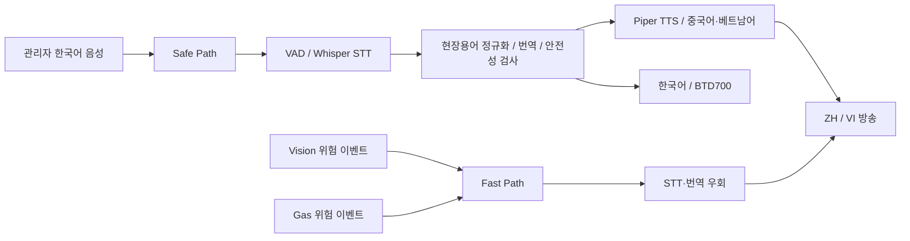
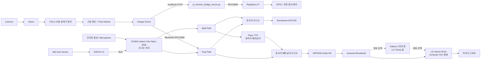

# SAY:FE

> 건설현장에서 외국인 근로자가 언어 장벽 때문에 안전정보를 놓치지 않도록, 위험을 자동 감지하고 관리자의 한국어 안전지시까지 중국어·베트남어로 실시간 전달하는 지능형 다국어 안전 시스템

SAY:FE는 제24회 임베디드 소프트웨어 경진대회 자유공모 부문 출품작입니다. 관리자 음성, 작업자·굴착기 영상, 가스 센서 정보를 하나의 안전방송 체계로 연결하여 한국어·중국어·베트남어 안내를 제공합니다.

## 1. 프로젝트 소개

SAY:FE는 두 종류의 안전정보를 목적에 맞는 경로로 처리합니다.

- 관리자의 다양한 한국어 지시는 음성을 인식하고 현장 문맥에 맞게 번역하는 **Safe Path**로 처리합니다.
- Vision 또는 Gas Sensor가 감지한 긴급 위험은 음성인식과 번역을 생략하는 **Fast Path**로 처리합니다.

한국어 오디오는 Sennheiser BTD700 경로로, 중국어·베트남어 오디오는 nRF5340 Audio DK의 Auracast 방송 경로로 전달됩니다. 실제 시연에서는 Galaxy 스마트폰의 LG ThinQ 앱에서 방송을 검색·선택했으며, Auracast Receiver인 LG xboom Rock이 방송을 수신·재생하여 외국인 근로자에게 전달했습니다.

## 2. 개발 배경 및 문제 정의

건설현장의 외국인 근로자는 언어 장벽뿐 아니라 현장 용어와 은어, 주변 소음 때문에 관리자의 안전지시를 정확히 이해하기 어렵습니다. 또한 작업자와 중장비의 비정상적인 근접이나 가스 위험처럼 즉각 대응해야 하는 상황에서는 번역 처리 시간이 경고 전달을 늦출 수 있습니다.

SAY:FE는 다음 문제를 함께 해결하도록 설계했습니다.

1. 관리자의 한국어 발화를 건설현장 문맥에 맞게 인식·보정·번역합니다.
2. 작업자·굴착기 영상과 MQ Gas Sensor 값을 이용해 위험을 자동 감지합니다.
3. 일반 지시와 긴급 경고를 서로 다른 처리 경로로 분리합니다.
4. 한국어·중국어·베트남어 오디오를 언어별 출력 장치로 전달합니다.
5. 위험 이벤트를 Raspberry Pi의 GPIO 제어까지 연결합니다.

## 3. 핵심 아이디어: Safe Path와 Fast Path

| 구분 | Safe Path | Fast Path |
|---|---|---|
| 입력 | 관리자의 한국어 음성 | Vision·Gas 위험 이벤트 |
| 목적 | 다양한 안전지시를 현장 문맥에 맞게 전달 | 위험 발생 시 긴급 경고를 즉시 전달 |
| 처리 | VAD → STT → 용어 정규화 → Verified Mapping/NLLB → 언어별 출력 | STT·번역 우회 → 사전 생성 KO/ZH/VI 경고음 |
| 주요 이벤트 | 관리자 발화 | `WORKER_NEAR_MOVING_EXCAVATOR`, `GAS_DANGER` |
| 출력 | 상황에 맞는 한국어·중국어·베트남어 안내 | 사전에 준비된 다국어 긴급 경고 |

일반 안전지시는 관리자의 다양한 문장을 처리해야 하지만, 위험 상황에서는 번역 과정의 지연보다 즉각적인 전달이 중요합니다. 따라서 SAY:FE는 일반 지시와 긴급 위험 경고를 Safe Path와 Fast Path로 분리했습니다. Fast Path가 실행되면 대기 중인 Safe Path 중국어·베트남어 PCM을 선점하고 긴급 경고를 우선 전달합니다.



## 4. 전체 시스템 구성



Galaxy 스마트폰은 실제 시연에서 LG ThinQ 앱을 실행하여 Auracast 방송을 검색·선택하는 제어 단말로 사용했습니다. 실제 방송은 Auracast Receiver인 LG xboom Rock에서 수신·재생됩니다.

## 5. 동작 파이프라인

### 5.1 관리자 음성 Safe Path

Safe Path는 관리자의 다양한 한국어 안전지시를 현장 문맥에 맞게 처리하고 필요한 언어로 전달하는 경로입니다.

```text
관리자 한국어 음성
→ Microphone
→ Silero VAD
→ Whisper STT
→ 건설현장 용어·은어 정규화
→ 현장 검증 번역 우선 Mapping
→ 필요한 경우 NLLB-200 / CTranslate2 번역
→ Safety Guard / Fallback
```

이후 언어에 따라 출력 경로가 나뉩니다.

- 한국어: `한국어 오디오 → Sennheiser BTD700`
- 중국어·베트남어: `번역문 → Piper TTS → nRF5340 Audio DK → Auracast Broadcast → LG ThinQ 앱에서 방송 검색·선택 → LG xboom Rock에서 Auracast 수신·재생 → 외국인 근로자`

### 5.2 Vision Fast Path

```text
Camera
→ YOLO 사람·굴착기 탐지
→ 작업자-굴착기 근접 판단
→ 굴착기 Pixel Motion 판단
→ WORKER_NEAR_MOVING_EXCAVATOR 생성
→ Bluetooth RFCOMM
→ Audio Fast Path
→ STT·번역 우회
→ 사전 생성 KO/ZH/VI 긴급 경고음 즉시 방송
```

동일한 Vision 이벤트는 장치 제어 경로로도 전달됩니다.

```text
Vision → localhost HTTP → pi_rfcomm_bridge_server.py
→ Bluetooth RFCOMM → Raspberry Pi → GPIO
→ 모형 굴착기 또는 안전장치 제어
```

Audio 시스템은 `WORKER_NEAR_MOVING_EXCAVATOR`를 Fast Path의 `WORKER_IN_EQUIPMENT_ZONE` 경고로 연결합니다.

### 5.3 Gas Fast Path

```text
MQ Gas Sensor
→ ESP32-C3
→ BLE
→ NVIDIA Jetson Orin Nano 8GB의 Audio 시스템
→ Threshold 판단
→ GAS_DANGER
→ Fast Path
→ 사전 생성 KO/ZH/VI 긴급 경고음 즉시 방송
```

## 6. 주요 기능

- VAD 기반 관리자 발화 구간 검출과 Whisper STT
- 건설현장 용어·은어 정규화 및 환각 결과 제거
- 현장 검증 번역 우선 Mapping과 NLLB-200 보완 번역
- Safety Guard/Fallback을 통한 안전문장 후처리
- Piper 기반 중국어·베트남어 TTS 및 언어별 오디오 출력
- YOLO 사람·굴착기 탐지, 근접 판단, Pixel Motion 기반 움직임 판단
- Vision·Gas 이벤트 기반 Fast Path와 Safe Path 선점
- Bluetooth RFCOMM, BLE, localhost HTTP를 이용한 장치 간 이벤트 연동
- Raspberry Pi JSON 이벤트 처리 및 GPIO 제어

## 7. 하드웨어 구성

| 하드웨어 | 역할 |
|---|---|
| NVIDIA Jetson Orin Nano 8GB | 관리자 음성 입력 처리, VAD, Whisper STT, 현장용어·은어 정규화, 번역, 중국어·베트남어 Piper TTS, Fast Path, BLE 가스 센서 수신, 언어별 오디오 출력 |
| nRF5340 Audio DK | 중국어·베트남어 오디오의 Auracast 방송 경로 |
| Sennheiser BTD700 | 한국어 오디오 출력 경로 |
| LG xboom Rock | 실제 Auracast Receiver이며, 선택된 안전방송을 수신·재생하는 최종 출력 장치 |
| Galaxy 스마트폰 | 실제 시연에서 LG ThinQ 앱을 통해 주변 Auracast 방송을 검색·선택하는 제어 단말 |
| ESP32-C3 | MQ 가스 센서 측정값을 BLE로 Audio 시스템에 전송 |
| Raspberry Pi | RFCOMM 위험 이벤트 수신, JSON 처리, GPIO 기반 모형 장비·안전장치 제어 |
| Camera | Vision 입력 영상 제공. 정확한 모델명은 문서에 특정하지 않음 |
| Microphone | 관리자 한국어 음성 입력. 정확한 모델명은 문서에 특정하지 않음 |

## 8. 소프트웨어 구성

| 영역 | 구성 요소 | 역할 |
|---|---|---|
| Audio | Flask, Silero VAD, whisper.cpp, NLLB-200, CTranslate2, Piper | 음성 입력부터 다국어 방송까지 Safe Path 실행 |
| Safety | Normalizer, Verified Mapping, Safety Guard, Fallback, Fast Path | 현장 문장 보정과 긴급 경고 우선 처리 |
| Vision | Ultralytics YOLO, OpenCV, Flask | 객체 탐지, 근접·움직임 판단, 위험 이벤트 생성 |
| Gas | ESP32-C3 Arduino source, Bleak | MQ 측정값 BLE 송신·수신과 Threshold 판단 |
| Control | Bluetooth RFCOMM, localhost HTTP bridge, RPi.GPIO | 위험 이벤트 전송과 Raspberry Pi GPIO 제어 |
| Auracast | pySerial 설정 script, nRF5340 Audio DK | ZH/VI 방송 프로그램 설정과 오디오 전달 |

## 9. Repository Structure

```text
audio/          관리자 음성 VAD/STT, 정규화, 번역, TTS, Fast Path, 언어별 오디오 출력
vision/         작업자·굴착기 탐지, 근접 판단, Pixel Motion, 위험 이벤트 생성
esp32_gas/      MQ Gas Sensor 측정 및 BLE 송신
raspberry_pi/   RFCOMM JSON 이벤트 수신 및 GPIO 안전장치 제어
integration/    Vision Host와 Raspberry Pi 사이 HTTP/RFCOMM Bridge
nrf5340/        nRF5340 Audio DK와 Auracast 구성 설명
models/         Vision 모델 정보와 외부 모델 포함 정책
docs/           시스템 구조, 실행 흐름, 하드웨어·소프트웨어 기술 문서
```

자세한 파일 구성은 [`docs/repository_structure.md`](docs/repository_structure.md)를 참고하십시오.

## 10. 실행 순서

장비별 모델, Python 환경, Bluetooth pairing, ALSA, serial, Camera, GPIO 권한을 먼저 준비합니다. 공개 문서에서는 실제 장비의 MAC address 대신 환경별 설정값을 사용합니다.

1. Vision Host와 Raspberry Pi의 RFCOMM 연결을 준비하고 `integration/pi_rfcomm_bridge_server.py`를 실행합니다.
2. Raspberry Pi에서 제출본의 `raspberry_pi/excavator_control.py`를 실행합니다.
3. NVIDIA Jetson Orin Nano 8GB에서 nRF5340 Audio DK를 연결하고 Audio 시스템을 실행합니다.
4. Vision 장치에서 `run.sh`를 실행합니다.
5. Audio/Vision UI에서 방송과 감지를 시작합니다.

### Audio 제출본 실행 형태

```bash
cd audio
SAYFE_GAS_ENABLED=1 \
SAYFE_GAS_MAC=<GAS_SENSOR_BT_MAC> \
SAYFE_GAS_THRESHOLD=1000 \
./run_ui_demo.sh
```

### Vision 제출본 실행 형태

```bash
cd vision
bash run.sh
```

### Raspberry Pi 제출본 실행 형태

```bash
cd raspberry_pi
python3 excavator_control.py
```

### Vision → Raspberry Pi Bridge

```bash
python3 integration/pi_rfcomm_bridge_server.py
```

## 11. 팀 개발 범위

외부 framework와 모델을 그대로 나열하는 데 그치지 않고, 다음 시스템 응용·통합 로직을 팀이 직접 구성했습니다.

- Audio pipeline orchestration과 KO/ZH/VI 언어별 출력
- 건설현장 용어 정규화, 은어 교정, 현장 검증 번역 우선 Mapping
- Safety Guard, Fallback, Fast Path 및 긴급 오디오 선점
- Vision proximity logic과 Pixel Motion 기반 굴착기 움직임 판단
- `WORKER_NEAR_MOVING_EXCAVATOR`, `GAS_DANGER` 위험 이벤트 연결
- Bluetooth RFCOMM 이벤트 연동과 ESP32-C3 BLE 가스 센서 연동
- Raspberry Pi 줄 단위 JSON 이벤트 처리 및 GPIO 제어
- Vision → Raspberry Pi localhost HTTP/RFCOMM Bridge
- nRF5340 Audio DK ZH/VI Auracast serial setup script

## 12. 외부 오픈소스 및 모델

Whisper, whisper.cpp, NLLB-200, CTranslate2, Piper, Silero VAD, Ultralytics YOLO, OpenCV, Flask, Bleak, Nordic nRF Connect SDK, Zephyr, RPi.GPIO 등을 사용합니다. 외부 실행 파일, 대형 모델, SDK 전체, virtual environment와 실행 결과 파일은 이 저장소에 포함하지 않습니다.

각 구성 요소의 역할과 확인된 license 정보는 [`THIRD_PARTY_NOTICES.md`](THIRD_PARTY_NOTICES.md)를 참고하십시오.
