# SAYFE

> **모두의 안전을, 각자의 언어로.**  
> Edge AI 기반 건설현장 실시간 다국어 안전소통 및 위험대응 시스템

SAYFE는 건설현장에서 외국인 근로자가 **언어 장벽과 현장 은어 때문에 안전정보를 놓치지 않도록**,  
관리자의 한국어 안전지시를 현장 문맥에 맞게 처리하여 한국어·중국어·베트남어로 전달하고,  
Vision AI와 Gas Sensor를 이용해 위험상황을 자동 감지하여 즉시 대응하는 지능형 안전 시스템입니다.

본 프로젝트는 **제24회 임베디드 소프트웨어 경진대회 자유공모 부문 출품작**입니다.

---

## 1. Project Overview

건설현장에서는 일반적인 안전방송뿐 아니라 다음과 같은 상황이 동시에 발생합니다.

- 외국인 근로자에게 관리자의 안전지시를 빠르게 전달해야 하는 상황
- `공구리`, `나라시`, `아시바`, `가네` 등 일반 번역기가 정확히 처리하기 어려운 현장 표현
- 작업자와 중장비의 위험한 근접 상황
- 가스 누출과 같이 즉시 대응해야 하는 위험상황

SAYFE는 이러한 문제를 하나의 시스템에서 처리하기 위해 안전정보 전달 경로를 **Safe Path**와 **Fast Path**로 분리합니다.

### Safe Path

관리자의 다양한 한국어 안전지시를 실시간으로 처리하는 경로입니다.

```text
관리자 한국어 발화
→ VAD
→ Whisper STT
→ 건설현장 용어·은어 정규화
→ 기준문장 Mapping / NLLB-200 번역
→ Safety Guard / Fallback
→ Piper TTS
→ KR / ZH / VI 안전방송
```

### Fast Path

Vision 또는 Gas Sensor에서 긴급 위험이 감지되었을 때 STT·번역·실시간 TTS 과정을 우회하는 경로입니다.

```text
Vision / Gas Danger Event
→ Fast Path
→ STT·번역 우회
→ 사전 생성 다국어 긴급 경고음
→ 일반 방송 선점
→ 즉시 KR / ZH / VI 경고방송
```

---

## 2. System Goals

SAYFE의 핵심 목표는 다음과 같습니다.

1. 관리자의 한국어 안전지시를 외국인 근로자의 언어로 전달
2. 건설현장에서 실제 사용되는 은어·전문용어를 표준 의미로 정규화
3. Vision AI를 이용한 작업자·중장비 위험상황 자동 인지
4. Gas Sensor를 이용한 가스 위험 감지
5. 긴급 위험 발생 시 일반 음성 AI 처리보다 Fast Path를 우선 실행
6. 한국어·중국어·베트남어를 언어별 독립 Audio 경로로 송출
7. 위험 이벤트를 실제 GPIO 기반 모형 장비·안전장치 제어까지 연결

---

## 3. 핵심 아이디어 — Safe Path & Fast Path

| 구분 | Safe Path | Fast Path |
|---|---|---|
| 입력 | 관리자 한국어 음성 | Vision / Gas 위험 이벤트 |
| 목적 | 다양한 안전지시 전달 | 긴급 위험 즉시 경고 |
| STT | 사용 | 우회 |
| 현장용어 정규화 | 사용 | 우회 |
| 실시간 번역 | 사용 | 우회 |
| TTS | 실시간 생성 | 사전 생성 음원 |
| 우선순위 | 일반 | 최우선 |
| 주요 이벤트 | 관리자 자유발화 | `WORKER_NEAR_MOVING_EXCAVATOR`, `GAS_DANGER` |
| 출력 | KR / ZH / VI | KR / ZH / VI |

위험 상황에서는 번역의 다양성보다 **전달 속도와 확실한 안전 의미 전달**이 중요합니다.

따라서 Fast Path 발생 시 기존 Safe Path Audio Queue를 선점하고 긴급 경고를 우선 출력하도록 구성했습니다.

---

## 4. Overall Architecture

```mermaid
flowchart LR

    ADMIN["관리자 한국어 음성"] --> AJ["NVIDIA Jetson Orin Nano 8GB"]

    AJ --> SAFE["Safe Path"]

    SAFE --> VAD["VAD"]
    VAD --> STT["Whisper STT"]
    STT --> NORMAL["현장용어·은어 정규화"]
    NORMAL --> TRANS["Reference Mapping / NLLB-200"]
    TRANS --> GUARD["Safety Guard / Fallback"]

    CAM["Camera"] --> VISION["Vision System"]
    VISION --> YOLO["YOLO Person / Excavator"]
    YOLO --> RULE["Proximity + Pixel Motion"]
    RULE --> VEVENT["Vision Danger Event"]

    GAS["MQ Gas Sensor"] --> ESP["ESP32-C3"]
    ESP -->|BLE| AJ

    VEVENT --> FAST["Fast Path"]
    AJ --> FAST

    FAST --> PREEMPT["Safe Path Audio Preemption"]

    GUARD --> KR["KR Audio"]
    PREEMPT --> KR
    KR --> BTD["Sennheiser BTD700"]

    GUARD --> TTS["Piper TTS"]
    TTS --> ZHVI["ZH / VI PCM Queue"]
    PREEMPT --> ZHVI

    ZHVI --> NRF["nRF5340 Audio DK"]
    NRF --> AURA["Auracast Broadcast"]

    AURA --> RECEIVER["Auracast Receiver"]
    RECEIVER --> WORKER["외국인 근로자"]

    VEVENT --> BRIDGE["HTTP / RFCOMM Bridge"]
    BRIDGE --> PI["Raspberry Pi"]
    PI --> GPIO["GPIO / 모형 장비·안전장치"]
```



---

## 5. Language & Audio Channels

SAYFE UI에서는 사용자가 다음 3개 언어를 선택할 수 있습니다.

| 언어 | UI 표시 | Broadcast Name | 출력 경로 |
|---|---|---|---|
| 한국어 | `KOREAN` | `KR` | Jetson → Sennheiser BTD700 |
| 중국어 | `CHINESE` | `ZH` | Jetson → nRF5340 Audio DK → Auracast |
| 베트남어 | `VIETNAMESE` | `VI` | Jetson → nRF5340 Audio DK → Auracast |

### Audio Output

```text
                         Audio Jetson
                              │
              ┌───────────────┼───────────────┐
              │               │               │
             KR              ZH              VI
              │               │               │
              ↓               └───────┬───────┘
        Sennheiser BTD700              │
              │                        ↓
              │               Independent PCM Queue
              │                        │
              │                        ↓
              │                nRF5340 Audio DK
              │                        │
              └──────────┐             ↓
                         │      Auracast Broadcast
                         │             KR / ZH / VI
                         │
                         ↓
                  Auracast Receiver
                         │
                         ↓
                    안전방송 재생
```

실제 시연에서는 Galaxy 스마트폰의 **LG ThinQ 앱**을 이용하여 Auracast 방송을 검색·선택하고, **LG XBOOM Rock**을 Auracast Receiver로 사용합니다.

Galaxy 스마트폰은 방송 선택을 위한 제어 단말이며 실제 Audio 재생은 Auracast Receiver가 담당합니다.

---

## 6. 관리자 음성 Safe Path

Safe Path는 관리자가 사용하는 자연스러운 한국어 안전지시를 처리합니다.

```text
Microphone
↓
Silero VAD
↓
Whisper STT
↓
normalize_text()
↓
normalize_construction_korean()
↓
건설현장 용어·은어 정규화
↓
등록 기준문장 Mapping 우선 적용
↓
미등록 문장 NLLB-200 / CTranslate2
↓
Safety Guard / Fallback
↓
Piper TTS
↓
KR / ZH / VI
```

### 실제 Audio Runtime Flow

현재 Audio 시스템의 최종 UI 통합 실행 흐름은 다음과 같습니다.

```text
audio/run_ui_demo.sh
        │
        ├─ scripts/setup_auracast_zh_vi.py
        │      └─ nRF5340 ZH / VI 방송 초기화
        │
        ↓
src/ui/safety_web.py
        │
        └─ UI에서 방송 시작
                ↓
scripts/ui_mic_controller.py
        │
        ├─ VAD / Microphone
        ├─ KR Audio
        │
        └─ scripts/ui_gpu_worker.py
                    │
                    ├─ Whisper STT
                    ├─ Text Normalizer
                    ├─ Construction Rules
                    ├─ NLLB Translation
                    ├─ Safety Guard
                    └─ Piper TTS
```

주요 Audio 코드:

```text
audio/
├── run_ui_demo.sh
│
├── src/
│   ├── ui/
│   │   └── safety_web.py
│   │
│   ├── stt/
│   │   ├── vad_engine.py
│   │   └── whisper_engine.py
│   │
│   ├── safety/
│   │   ├── normalizer.py
│   │   └── construction_rules.py
│   │
│   ├── translation/
│   │   └── nllb_engine.py
│   │
│   └── audio/
│       ├── korean_auracast_output.py
│       └── auracast_output.py
│
└── scripts/
    ├── setup_auracast_zh_vi.py
    ├── ui_mic_controller.py
    └── ui_gpu_worker.py
```

---

## 7. 현장자문 기반 건설용어 처리

일반 한국어 STT·번역 모델은 건설현장에서 사용되는 은어와 일본식 현장용어를 정확히 처리하기 어렵습니다.

SAYFE는 건설현장 안전관리자 자문을 통해 실제 현장에서 사용되는 표현과 사용 맥락을 확인하고, 이를 **현장용어 정규화 규칙 개선**에 반영했습니다.

현장자문에서 실제 사용이 확인된 대표 표현은 다음과 같습니다.

| 현장 표현 | 정규화 의미 예시 |
|---|---|
| 공구리 | 콘크리트 |
| 나라시 | 바닥면 고르기 / 평탄화 |
| 아시바 | 비계·작업발판 |
| 곰방 | 자재 운반 |
| 단도리 | 작업 준비 |
| 바라시 | 거푸집 해체 |
| 하이바 | 안전모 |

예를 들어 다음 발화는:

```text
오늘 공구리 치니까 가네 먼저 잡아라.
```

시스템 내부에서 현장 문맥에 맞는 표준 의미로 보정한 뒤 번역합니다.

```text
오늘 콘크리트 타설 작업을 진행하니,
먼저 직각을 정확히 맞추십시오.
```

또한:

```text
아시바 먼저 놓고 위에서 작업해.
```

와 같은 문장은 다음과 같이 정규화할 수 있습니다.

```text
비계를 먼저 설치한 뒤 상부에서 작업하십시오.
```

현장자문은 **현장용어의 실제 사용 여부와 의미·사용 맥락을 확인하는 데 활용**했으며, 중국어·베트남어 번역은 별도의 기준문장, Safety Guard 및 Translation Fallback을 통해 관리합니다.

---

## 8. Translation Safety

단순 NLLB 출력만 사용하는 경우 안전문장의 일부 의미가 누락될 가능성이 있기 때문에 SAYFE는 번역 이후 별도의 Safety 처리 단계를 적용합니다.

```text
Normalized Korean
↓
Reference Mapping 또는 NLLB
↓
Safety Guard
↓
위험 행동 / 금지 / 대피 / 보호구 등 핵심 의미 검사
↓
필요 시 Translation Fallback
↓
Final Translation
```

특히 다음과 같은 안전 의미가 번역 과정에서 유지되는지를 확인합니다.

```text
작업 중지
접근 금지
대피
환기
보호구 착용
감전 위험
중장비 접근 금지
가스 위험
추락 위험
```

---

## 9. Vision Fast Path

Vision System은 Camera 영상에서 `person`과 `excavator`를 탐지합니다.

객체 탐지 결과만으로 위험을 판단하지 않고, **작업자-굴착기 간 거리와 굴착기 움직임**을 함께 사용합니다.

```text
Camera
↓
YOLO
↓
Person / Excavator Detection
↓
Proximity Logic
↓
Pixel Motion
↓
WORKER_NEAR_MOVING_EXCAVATOR
↓
Fast Path
```

위험 이벤트 발생 시 Audio System에서는 이를 긴급 중장비 위험 이벤트로 처리합니다.

```text
WORKER_NEAR_MOVING_EXCAVATOR
↓
Fast Path
↓
STT / NLLB / Realtime TTS 우회
↓
사전 생성 KR / ZH / VI 긴급 경고
↓
일반 Audio Queue 선점
```

동일한 Vision Event는 Raspberry Pi 제어 시스템에도 전달됩니다.

```text
Vision System
↓
localhost HTTP
↓
pi_rfcomm_bridge_server.py
↓
Bluetooth RFCOMM
↓
Raspberry Pi
↓
GPIO
↓
모형 굴착기 / 안전장치 제어
```

---

## 10. Gas Fast Path

Gas Sensor는 ESP32-C3에 연결됩니다.

```text
MQ Gas Sensor
↓
ESP32-C3
↓
BLE
↓
Audio Jetson
↓
Threshold 판단
↓
GAS_DANGER
↓
Fast Path
```

`GAS_DANGER`가 발생하면 실시간 번역 과정과 관계없이 사전 생성된 긴급 안전방송을 즉시 사용합니다.

```text
GAS_DANGER
↓
Safe Path Preemption
↓
KR / ZH / VI 긴급 경고 Audio
↓
Auracast
```

---

## 11. Fast Path Preemption

관리자의 일반 안전방송이 재생되는 중에도 위험 이벤트가 발생할 수 있습니다.

SAYFE는 위험 이벤트가 발생하면 기존 Safe Path Audio를 제거하고 Fast Path Audio를 우선 출력하도록 구성했습니다.

```text
Safe Path Audio 재생 중
↓
GAS_DANGER 또는 Vision Danger
↓
Audio Generation 변경
↓
기존 Safe Path PCM 폐기
↓
Fast Path PCM Queue
↓
긴급방송 우선 출력
```

기존 Safe Path의 늦게 생성된 Audio가 다시 Queue에 들어오는 것을 방지하기 위해 **Generation Guard**를 적용합니다.

---

## 12. Performance Evaluation

### 12.1 평가 데이터

Audio Pipeline은 총 **50개 실제 녹음 문장**을 이용해 평가했습니다.

| 구분 | 문장 수 |
|---|---:|
| 일반 안전문장 | 20 |
| 현장용어·은어 포함 문장 | 30 |
| **전체** | **50** |

---

### 12.2 STT Performance

Domain Prompt 및 제한적인 건설현장 용어 보정을 포함한 최종 STT Pipeline 결과입니다.

| Metric | Result |
|---|---:|
| Raw CER | 4.88% |
| Corrected CER | **0.57%** |
| Raw WER | 18.73% |
| Corrected WER | **8.91%** |

> `Corrected CER 0.57%`는 Whisper 단독 성능이 아니라 **Domain Prompt + 현장용어 후처리를 포함한 최종 STT Pipeline 성능**입니다.

---

### 12.3 Translation Execution

하나의 NLLB Model을 공유하여 Sequential / Batch / Parallel 방식을 비교했습니다.

| Mode | Mean | P50 | P95 |
|---|---:|---:|---:|
| Sequential | 0.7315 s | 0.6998 s | 1.0322 s |
| **Batch** | **0.4900 s** | **0.4523 s** | **0.6809 s** |
| Parallel | 0.6930 s | 0.6605 s | 0.9940 s |

현재 2개 외국어 번역에서는 **Batch Translation**이 가장 빠른 결과를 보였습니다.

---

### 12.4 Chinese / Vietnamese TTS

중국어와 베트남어 TTS의 Sequential / Parallel 방식을 비교했습니다.

| Metric | Sequential | Parallel |
|---|---:|---:|
| Pair Wall Mean | 1.8963 s | **1.5956 s** |
| Both Languages Ready Mean | 1.7999 s | **1.5090 s** |
| Both Languages Ready P95 | 2.0198 s | **1.8968 s** |

두 언어가 모두 준비되는 평균 시간 기준으로 Parallel TTS가 약 **16.16% 개선**되었습니다.

---

### 12.5 Audio End-to-End

녹음된 WAV 입력 이후:

```text
STT
→ Construction Normalizer
→ Translation
→ Safety Guard
→ Parallel TTS
```

까지의 Post-Utterance E2E 결과입니다.

| Stage | Mean | P50 | P95 |
|---|---:|---:|---:|
| STT | 0.6335 s | 0.6129 s | 0.7202 s |
| Translation | 0.5207 s | 0.4570 s | 0.7029 s |
| Parallel TTS | 1.8470 s | 1.8571 s | 2.2741 s |
| ZH First Audio | 2.7043 s | 2.6382 s | 3.1675 s |
| VI First Audio | 2.6766 s | 2.5914 s | 3.2362 s |
| **Both Languages Ready** | **2.8062 s** | **2.7434 s** | **3.2668 s** |
| Complete | 3.0016 s | 2.9180 s | 3.6798 s |

### Stability

| Item | Result |
|---|---:|
| Completed | **50 / 50** |
| Failures | **0** |
| Final Safety Guard Pass | **50 / 50** |
| OOM | **0** |

> 위 E2E 결과는 **녹음된 WAV 입력 이후의 Post-Utterance Audio AI Pipeline 성능**입니다.  
> 사용자의 실제 발화 시간, VAD가 발화 종료를 기다리는 시간 및 최종 무선 수신 구간은 포함하지 않습니다.

---

### 12.6 Resource Usage

50문장 E2E 평가 중 Jetson Resource 사용량입니다.

| Metric | Result |
|---|---:|
| CPU Mean | 50.34% |
| GPU Mean | 30.69% |
| GPU Peak | 99% |
| RAM Peak | 약 5.9 ~ 6.0 GB |
| SWAP Peak | 약 469 MB |
| OOM | 0 |

Whisper / NLLB Pipeline에서 실제 GPU 사용을 확인했으며 E2E 평가 중 OOM은 발생하지 않았습니다.

---

## 13. Vision Dataset & Model

### Training Dataset

Vision Object Detection Model은 **AI Hub 「건설 위험 상태 판단」 데이터셋**과 자체 제작한 건설현장 목업 촬영 데이터를 혼합하여 학습했습니다.

| Dataset | Total | Train | Validation |
|---|---:|---:|---:|
| AI Hub | 3,200 | 2,814 | 386 |
| 자체 목업 | 250 | 200 | 50 |
| **Total** | **3,450** | **3,014** | **436** |

데이터 출처:

- [AI-Hub](https://aihub.or.kr/)

AI Hub 원본 데이터는 이용정책에 따라 Repository에 포함하지 않습니다.

Repository에는 해당 데이터를 활용하여 학습한 Model Weight 및 Training Result를 포함합니다.

### Object Classes

```text
person
excavator
```

---

### Training Configuration

| Item | Configuration |
|---|---|
| Base Model | YOLO11n (`yolo11n.pt`) |
| Task | Object Detection |
| Image Size | 640 × 640 |
| Epochs | 80 |
| Batch Size | 32 |
| Pretrained | True |
| Optimizer | Auto |
| AMP | True |
| Validation | True |

상세 설정:

- [`vision/training_results/args.yaml`](vision/training_results/args.yaml)

Epoch별 결과:

- [`vision/training_results/results.csv`](vision/training_results/results.csv)

---

### Vision Training Results

| Metric | Result |
|---|---:|
| Precision | **0.9978** |
| Recall | **0.9988** |
| mAP@0.5 | **0.9950** |
| mAP@0.5:0.95 | **0.8982** |

### Training Curves


### Normalized Confusion Matrix


### Model Weight

```text
vision/best.pt
```

---

## 14. Hardware

| Hardware | Role |
|---|---|
| NVIDIA Jetson Orin Nano 8GB | VAD, STT, 건설용어 정규화, 번역, TTS, Fast Path, BLE Gas 수신, Audio Orchestration |
| nRF5340 Audio DK | ZH / VI Auracast Broadcast |
| Sennheiser BTD700 | KR Audio Broadcast |
| LG XBOOM Rock | Auracast Receiver / Audio Playback |
| Galaxy Smartphone | LG ThinQ 기반 Auracast 방송 검색·선택 |
| ESP32-C3 | MQ Gas Sensor 측정 및 BLE 전송 |
| Raspberry Pi | RFCOMM Event 수신, JSON 처리, GPIO 제어 |
| Camera | Vision Input |
| Microphone | 관리자 한국어 음성 입력 |

---

## 15. Software Stack

| Area | Technology | Role |
|---|---|---|
| UI | Flask | SAYFE Web UI |
| VAD | Silero VAD | 관리자 발화 구간 검출 |
| STT | Whisper / whisper.cpp | 한국어 Speech-to-Text |
| Normalization | Python Rule Engine | 건설현장 은어·전문용어 정규화 |
| Translation | NLLB-200 / CTranslate2 | 중국어·베트남어 번역 |
| Translation Safety | Safety Guard / Fallback | 안전 의미 검사 및 보정 |
| TTS | Piper | 중국어·베트남어 음성 생성 |
| Vision | Ultralytics YOLO / OpenCV | Person / Excavator Detection |
| Gas | ESP32-C3 / Bleak | MQ Gas Sensor BLE |
| Communication | Bluetooth RFCOMM / HTTP | Device Event 전달 |
| Control | RPi.GPIO | 모형 장비·안전장치 제어 |
| Auracast | nRF5340 Audio DK / nRF Audio | ZH / VI Audio Broadcast |

---

## 16. Main Features

### Audio / Language

- 관리자 한국어 실시간 음성 입력
- VAD 기반 발화 구간 검출
- Whisper STT
- 건설현장 은어·전문용어 정규화
- 등록 기준문장 Mapping
- NLLB-200 중국어·베트남어 번역
- Safety Guard / Translation Fallback
- Piper TTS
- KR / ZH / VI 언어 선택 UI
- 독립 PCM Queue
- Piper Raw PCM Streaming
- Auracast Audio Output

### Safety

- Safe Path / Fast Path 분리
- 긴급 Audio Queue Preemption
- Generation Guard
- 사전 생성 긴급 경고음
- `GAS_DANGER`
- `WORKER_NEAR_MOVING_EXCAVATOR`

### Vision

- Person Detection
- Excavator Detection
- Proximity Logic
- Pixel Motion 기반 굴착기 움직임 판단
- Danger Event 생성

### Gas / Control

- ESP32-C3 BLE Gas Sensor
- Gas Threshold 판단
- Bluetooth RFCOMM Event 전달
- Raspberry Pi JSON Event 처리
- GPIO 기반 장치 제어

---

## 17. Demo Scenarios

### Scenario A — 관리자 현장 안전지시

```text
관리자:
"오늘 공구리 치니까 가네 먼저 잡아라."

↓ STT

↓ 현장용어 정규화

"오늘 콘크리트 타설 작업을 진행하니
먼저 직각을 정확히 맞추십시오."

↓ ZH / VI Translation

↓ TTS

↓ KR / ZH / VI Broadcast
```

---

### Scenario B — Vision Danger

```text
작업자와 이동 중인 굴착기 근접
↓
Vision AI
↓
WORKER_NEAR_MOVING_EXCAVATOR
↓
Fast Path
↓
일반방송 선점
↓
KR / ZH / VI 긴급 경고
↓
Raspberry Pi GPIO 장비 제어
```

---

### Scenario C — Gas Danger

```text
MQ Gas Sensor Threshold 초과
↓
ESP32-C3
↓ BLE
Jetson
↓
GAS_DANGER
↓
Fast Path
↓
KR / ZH / VI 긴급 경고
```

---

### Scenario D — Preemption

```text
관리자 Safe Path 방송 재생 중
↓
갑작스러운 GAS_DANGER / Vision Danger
↓
기존 Safe Path PCM 제거
↓
Fast Path 선점
↓
긴급 경고 우선 송출
```

---

## 18. Repository Structure

```text
2026ESWContest_free_SAYFE/
│
├── audio/
│   ├── run_ui_demo.sh
│   │
│   ├── scripts/
│   │   ├── setup_auracast_zh_vi.py
│   │   ├── ui_mic_controller.py
│   │   └── ui_gpu_worker.py
│   │
│   └── src/
│       ├── ui/
│       │   └── safety_web.py
│       │
│       ├── stt/
│       │   ├── vad_engine.py
│       │   └── whisper_engine.py
│       │
│       ├── safety/
│       │   ├── normalizer.py
│       │   └── construction_rules.py
│       │
│       ├── translation/
│       │   └── nllb_engine.py
│       │
│       └── audio/
│           ├── korean_auracast_output.py
│           └── auracast_output.py
│
├── vision/
│   ├── best.pt
│   └── training_results/
│       ├── args.yaml
│       ├── results.csv
│       ├── results.png
│       └── confusion_matrix_normalized.png
│
├── esp32_gas/
│   └── MQ Gas Sensor / BLE
│
├── raspberry_pi/
│   └── RFCOMM JSON Event / GPIO
│
├── integration/
│   └── pi_rfcomm_bridge_server.py
│
├── nrf5340/
│   ├── README.md
│   │
│   └── ncs/
│       └── v3.4.0/
│           └── nrf/
│               ├── applications/
│               │   └── nrf_audio/
│               │
│               └── samples/
│                   └── bluetooth/
│                       └── nrf_auraconfig/
│
├── models/
│   └── Model Information
│
├── docs/
│   └── System / Software / Hardware Architecture
│
├── THIRD_PARTY_LICENSES.txt
├── THIRD_PARTY_NOTICES.md
└── README.md
```

자세한 Repository 구성은 다음 문서를 참고하십시오.

- [`docs/repository_structure.md`](docs/repository_structure.md)

---

## 19. Run

실행 전 각 장비의 Python 환경, Bluetooth Pairing, ALSA, Serial, Camera 및 GPIO 권한을 설정해야 합니다.

### Step 1. Vision → Raspberry Pi Bridge

```bash
python3 integration/pi_rfcomm_bridge_server.py
```

### Step 2. Raspberry Pi Control

```bash
cd raspberry_pi
python3 excavator_control.py
```

### Step 3. Audio System

```bash
cd audio

SAYFE_GAS_ENABLED=1 \
SAYFE_GAS_MAC=<GAS_SENSOR_BT_MAC> \
SAYFE_GAS_THRESHOLD=1000 \
./run_ui_demo.sh
```

Audio System 실행 후 Web UI에서 송출 언어를 선택하고 방송을 시작합니다.

```text
KOREAN
CHINESE
VIETNAMESE
```

`run_ui_demo.sh`는 먼저:

```text
scripts/setup_auracast_zh_vi.py
```

를 실행하여 nRF5340 Audio DK의 ZH / VI Auracast 환경을 설정한 후:

```text
src/ui/safety_web.py
```

를 실행합니다.

UI에서 방송을 시작하면:

```text
scripts/ui_mic_controller.py
```

가 시작되고 내부에서:

```text
scripts/ui_gpu_worker.py
```

를 실행하여 STT → 정규화 → 번역 → TTS Pipeline을 처리합니다.

### Step 4. Vision

```bash
cd vision
bash run.sh
```

---

## 20. nRF5340 / Auracast

SAYFE의 외국어 Audio 송출은 Nordic Semiconductor의 **nRF Connect SDK 기반 nRF Audio 환경**을 사용합니다.

```text
ZH
→ nRF5340 Audio DK
→ Auracast

VI
→ nRF5340 Audio DK
→ Auracast
```

관련 SAYFE Integration Code:

- [`audio/scripts/setup_auracast_zh_vi.py`](audio/scripts/setup_auracast_zh_vi.py)
- [`audio/src/audio/auracast_output.py`](audio/src/audio/auracast_output.py)
- [`audio/scripts/ui_gpu_worker.py`](audio/scripts/ui_gpu_worker.py)
- [`audio/run_ui_demo.sh`](audio/run_ui_demo.sh)

nRF 관련 상세 내용:

- [`nrf5340/README.md`](nrf5340/README.md)

---

### Nordic Provided Source

실제 구현 환경 및 경진대회 제출을 위해 사용한 Nordic 관련 Source는 다음 경로에 포함합니다.

```text
nrf5340/ncs/v3.4.0/nrf/applications/nrf_audio/
```

```text
nrf5340/ncs/v3.4.0/nrf/samples/bluetooth/nrf_auraconfig/
```

해당 Source는 Nordic Semiconductor가 제공한 nRF Connect SDK Source이며, SAYFE 팀이 작성한 Integration Code와 구분하여 관리합니다.

---

## 21. Team Implementation Scope

SAYFE는 외부 AI Model이나 Framework를 단순 연결하는 방식이 아니라 각 구성요소를 건설현장 안전 시나리오에 맞게 통합하는 **System Integration Logic**을 구현했습니다.

### Audio Pipeline

```text
VAD
→ STT
→ Construction Normalizer
→ Translation
→ Safety Guard
→ Parallel TTS
→ Independent PCM Queue
→ Auracast
```

### Event Orchestration

```text
Supervisor Voice
→ Safe Path

Vision Event
→ Fast Path

Gas Event
→ Fast Path
```

### Physical Safety Control

```text
Vision Danger Event
→ HTTP / RFCOMM
→ Raspberry Pi
→ GPIO
→ Physical Device
```

---

## 22. Third-Party Software

SAYFE는 다음 외부 Software / Framework / Model을 사용합니다.

- Whisper / whisper.cpp
- NLLB-200
- CTranslate2
- Piper
- Silero VAD
- Ultralytics YOLO
- OpenCV
- Flask
- Bleak
- Nordic nRF Connect SDK / nRF Audio
- RPi.GPIO

외부 대형 Model, Virtual Environment 및 AI Hub 원본 Dataset은 Repository에 포함하지 않습니다.

단, 실제 nRF5340 Auracast 구현 환경 확인을 위해 사용한 Nordic nRF Source는 `nrf5340/ncs/`에 포함합니다.

Nordic 제공 Source와 SAYFE 팀 작성 Integration Code는 명확하게 구분하여 관리합니다.

---

## 23. License & Notices

### Nordic Semiconductor

This project uses software components provided by Nordic Semiconductor ASA.

The applicable Nordic Semiconductor software components are distributed under the Nordic 5-Clause License.

The original license text is provided in:

- [`THIRD_PARTY_LICENSES.txt`](THIRD_PARTY_LICENSES.txt)

각 외부 Software / Framework / Model의 역할과 License 정보:

- [`THIRD_PARTY_NOTICES.md`](THIRD_PARTY_NOTICES.md)

nRF 관련 Source 내부의 기존 License, Notice 및 SPDX 정보는 원본 상태를 유지합니다.

---

## 24. Safety Notice

SAYFE는 **임베디드 소프트웨어 경진대회 연구·시연용 Prototype**입니다.

본 시스템의 AI 위험판단, 자동번역 및 장비제어 기능은 실제 산업현장의 법정 안전설비 또는 인증된 산업안전 시스템을 대체하기 위한 것이 아닙니다.

실제 산업현장 적용 시에는 별도의 안전성 검증, 통신 신뢰성 검증 및 관련 법규·인증 기준을 충족해야 합니다.

---

## SAYFE

> **모두의 안전을, 각자의 언어로.**

언어 때문에 놓치는 안전정보가 없도록,  
SAYFE는 관리자 음성, Vision AI, Gas Sensor, Edge AI 그리고 Auracast를 하나의 건설현장 안전 시스템으로 연결합니다.
