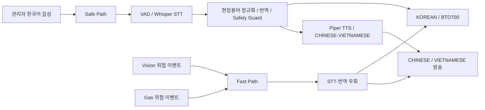
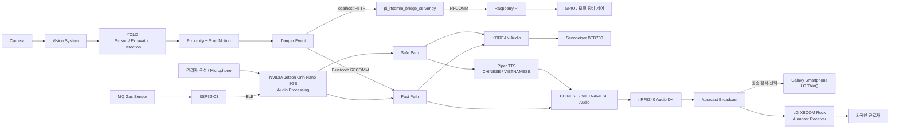
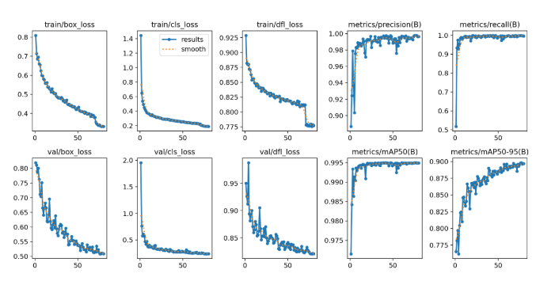
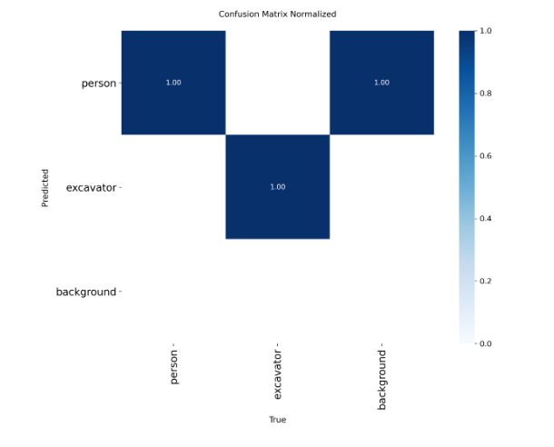

# SAYFE

> 건설현장에서 외국인 근로자가 언어 장벽 때문에 안전정보를 놓치지 않도록, 위험을 자동 감지하고 관리자의 한국어 안전지시를 한국어(KOREAN)·중국어(CHINESE)·베트남어(VIETNAMESE)로 전달하는 지능형 다국어 안전 시스템

SAYFE는 **제24회 임베디드 소프트웨어 경진대회 자유공모 부문 출품작**입니다.

관리자 음성, 작업자·굴착기 영상, 가스 센서 정보를 하나의 안전 시스템으로 연결하여 일반 안전지시는 실시간 다국어 음성처리로 전달하고, 긴급 위험 상황은 별도의 Fast Path를 통해 즉시 경고합니다.

---

## 1. 프로젝트 소개

SAYFE는 건설현장에서 발생하는 안전정보를 목적에 따라 두 개의 경로로 처리합니다.

- 관리자의 다양한 한국어 안전지시는 음성을 인식하고 건설현장 문맥에 맞게 보정·번역하는 **Safe Path**로 처리합니다.
- Vision 또는 Gas Sensor가 감지한 긴급 위험은 STT와 번역 과정을 우회하는 **Fast Path**로 처리합니다.

SAYFE는 다음 3개 언어의 안전방송을 제공합니다.

| 언어 | Broadcast Name | 주요 출력 경로 |
|---|---|---|
| 한국어 | `KOREAN` | Audio Jetson → Sennheiser BTD700 |
| 중국어 | `CHINESE` | Audio Jetson → nRF5340 Audio DK → Auracast |
| 베트남어 | `VIETNAMESE` | Audio Jetson → nRF5340 Audio DK → Auracast |

실제 시연에서는 Galaxy 스마트폰의 LG ThinQ 앱에서 Auracast 방송을 검색·선택하고, **LG XBOOM Rock**이 Auracast Receiver로 CHINESE / VIETNAMESE 방송을 수신·재생합니다.

Galaxy 스마트폰은 방송을 검색·선택하기 위한 제어 단말이며, 실제 Auracast Audio의 수신·재생은 LG XBOOM Rock이 담당합니다.

---

## 2. 개발 배경 및 문제 정의

건설현장의 외국인 근로자는 언어 장벽뿐 아니라 현장 용어와 은어, 주변 소음 때문에 관리자의 안전지시를 정확히 이해하기 어렵습니다.

또한 작업자와 중장비의 비정상적인 근접이나 가스 위험처럼 즉각 대응해야 하는 상황에서는 STT·번역·TTS 처리 시간이 긴급 경고 전달을 지연시킬 수 있습니다.

SAYFE는 다음 문제를 함께 해결하도록 설계했습니다.

1. 관리자의 한국어 발화를 건설현장 문맥에 맞게 인식·보정·번역합니다.
2. 작업자·굴착기 영상과 MQ Gas Sensor 값을 이용해 위험을 자동 감지합니다.
3. 일반 안전지시와 긴급 위험경고를 서로 다른 처리 경로로 분리합니다.
4. KOREAN / CHINESE / VIETNAMESE Audio를 언어별 출력 경로로 전달합니다.
5. 위험 이벤트를 Raspberry Pi의 GPIO 제어까지 연결하여 실제 안전장치 제어 가능성을 구현합니다.

---

## 3. 핵심 아이디어: Safe Path와 Fast Path

| 구분 | Safe Path | Fast Path |
|---|---|---|
| 입력 | 관리자의 한국어 음성 | Vision·Gas 위험 이벤트 |
| 목적 | 다양한 안전지시를 현장 문맥에 맞게 전달 | 위험 발생 시 긴급 경고를 즉시 전달 |
| 처리 | VAD → STT → 용어 정규화 → Verified Mapping / NLLB → TTS | STT·번역 우회 → 사전 생성 KO/ZH/VI 경고음 |
| 주요 이벤트 | 관리자 발화 | `WORKER_NEAR_MOVING_EXCAVATOR`, `GAS_DANGER` |
| 출력 | KOREAN / CHINESE / VIETNAMESE 안전방송 | 사전 생성된 다국어 긴급 경고 |

일반 안전지시는 관리자의 다양한 문장을 처리해야 하지만, 위험 상황에서는 번역 정확도뿐 아니라 **전달 속도**가 중요합니다.

따라서 SAYFE는 일반 지시와 긴급 위험경고를 Safe Path와 Fast Path로 분리했습니다.

Fast Path가 발생하면 대기 중인 일반 방송보다 긴급 경고 Audio를 우선 처리합니다.



---

## 4. 전체 시스템 구성



### 언어별 Audio 출력

```text
                     Audio Jetson
                          │
          ┌───────────────┼───────────────┐
          │               │               │
       KOREAN          CHINESE        VIETNAMESE
          │               │               │
          ↓               └───────┬───────┘
       BTD700                      ↓
          │               auracast_output.py
          ↓                        ↓
   한국어 안전방송          48 kHz Stereo PCM
                                   ↓
                          nRF5340 Audio DK
                                   ↓
                          Auracast Broadcast
                                   ↓
                         LG XBOOM Rock
                                   ↓
                           외국인 근로자
```

---

## 5. 동작 파이프라인

### 5.1 관리자 음성 Safe Path

Safe Path는 관리자의 다양한 한국어 안전지시를 건설현장 문맥에 맞게 처리한 뒤 KOREAN / CHINESE / VIETNAMESE로 전달합니다.

```text
관리자 한국어 음성
→ Microphone
→ Silero VAD
→ Whisper STT
→ 건설현장 용어·은어 정규화
→ 현장 검증 번역 우선 Mapping
→ 필요한 경우 NLLB-200 / CTranslate2 번역
→ Safety Guard / Fallback
```

이후 언어에 따라 출력 경로가 분리됩니다.

### KOREAN

```text
KOREAN Audio
→ Sennheiser BTD700
→ 한국어 안전방송
```

### CHINESE / VIETNAMESE

```text
번역문
→ Piper TTS
→ auracast_output.py
→ 48 kHz Stereo PCM
→ nRF5340 Audio DK
→ Auracast Broadcast
→ LG ThinQ 앱에서 방송 검색·선택
→ LG XBOOM Rock
→ 외국인 근로자
```

---

### 5.2 Vision Fast Path

```text
Camera
→ YOLO Person / Excavator Detection
→ 작업자-굴착기 근접 판단
→ 굴착기 Pixel Motion 판단
→ WORKER_NEAR_MOVING_EXCAVATOR
→ Bluetooth RFCOMM
→ Audio Fast Path
→ STT·번역 우회
→ 사전 생성 KO/ZH/VI 긴급 경고음
→ 언어별 출력
```

Audio 시스템은 `WORKER_NEAR_MOVING_EXCAVATOR` 이벤트를 Fast Path의 `WORKER_IN_EQUIPMENT_ZONE` 경고로 연결합니다.

동일한 Vision 이벤트는 장치 제어 경로로도 전달됩니다.

```text
Vision
→ localhost HTTP
→ pi_rfcomm_bridge_server.py
→ Bluetooth RFCOMM
→ Raspberry Pi
→ GPIO
→ 모형 굴착기 또는 안전장치 제어
```

---

### 5.3 Gas Fast Path

```text
MQ Gas Sensor
→ ESP32-C3
→ BLE
→ NVIDIA Jetson Orin Nano 8GB
→ Threshold 판단
→ GAS_DANGER
→ Fast Path
→ 사전 생성 KO/ZH/VI 긴급 경고음
→ 언어별 출력
```

Gas Sensor 값이 설정 Threshold를 초과하면 `GAS_DANGER` 이벤트를 생성하고 Fast Path를 실행합니다.

---

## 6. 주요 기능

- Silero VAD 기반 관리자 발화 구간 검출
- Whisper 기반 한국어 STT
- 건설현장 용어·은어 정규화
- 현장 검증 번역 우선 Mapping
- NLLB-200 / CTranslate2 기반 CHINESE / VIETNAMESE 번역
- Safety Guard / Fallback을 통한 안전문장 후처리
- Piper 기반 CHINESE / VIETNAMESE TTS
- KOREAN / CHINESE / VIETNAMESE 언어별 Audio 출력
- YOLO 기반 Person / Excavator Detection
- 작업자·굴착기 근접 판단
- Pixel Motion 기반 굴착기 움직임 판단
- Vision·Gas Event 기반 Fast Path
- Fast Path의 일반 Audio Queue 선점
- Bluetooth RFCOMM 기반 장치 간 위험 이벤트 전달
- ESP32-C3 BLE Gas Sensor 연동
- Raspberry Pi JSON Event 처리 및 GPIO 제어
- nRF5340 Audio DK 기반 CHINESE / VIETNAMESE Auracast Broadcast

---

## 7. 하드웨어 구성

| 하드웨어 | 역할 |
|---|---|
| NVIDIA Jetson Orin Nano 8GB | 관리자 음성 입력 처리, VAD, Whisper STT, 현장용어 정규화, 번역, CHINESE / VIETNAMESE Piper TTS, Fast Path, BLE Gas Sensor 수신, 언어별 Audio 출력 |
| nRF5340 Audio DK | CHINESE / VIETNAMESE Audio의 Auracast Broadcast |
| Sennheiser BTD700 | KOREAN Audio 출력 경로 |
| LG XBOOM Rock | 실제 Auracast Receiver. 선택된 CHINESE / VIETNAMESE 안전방송 수신·재생 |
| Galaxy 스마트폰 | 실제 시연에서 LG ThinQ 앱으로 Auracast 방송 검색·선택 |
| ESP32-C3 | MQ Gas Sensor 값을 BLE로 Audio System에 전송 |
| Raspberry Pi | RFCOMM 위험 이벤트 수신, JSON 처리, GPIO 기반 모형 장비·안전장치 제어 |
| Camera | Vision 입력 영상 |
| Microphone | 관리자 한국어 음성 입력 |

---

## 8. 소프트웨어 구성

| 영역 | 구성 요소 | 역할 |
|---|---|---|
| Audio | Flask, Silero VAD, whisper.cpp, NLLB-200, CTranslate2, Piper | 관리자 음성 입력부터 다국어 안전방송까지 Safe Path 실행 |
| Safety | Normalizer, Verified Mapping, Safety Guard, Fallback, Fast Path | 현장 문장 보정 및 긴급 경고 우선 처리 |
| Vision | Ultralytics YOLO, OpenCV, Flask | Person / Excavator Detection, 근접·움직임 판단, 위험 이벤트 생성 |
| Gas | ESP32-C3 Arduino Source, Bleak | MQ 측정값 BLE 송·수신 및 Threshold 판단 |
| Control | Bluetooth RFCOMM, localhost HTTP Bridge, RPi.GPIO | 위험 이벤트 전달 및 Raspberry Pi GPIO 제어 |
| Auracast | pySerial, nRF5340 Audio DK, nRF Audio | CHINESE / VIETNAMESE 방송 설정 및 Auracast Audio 송출 |

---

## 9. Repository Structure

```text
2026ESWContest_free_SAYFE/
│
├── audio/
│   ├── 관리자 음성 VAD / STT
│   ├── 현장용어 정규화
│   ├── CHINESE / VIETNAMESE 번역 및 TTS
│   ├── Fast Path
│   └── 언어별 Audio 출력
│
├── vision/
│   ├── Person / Excavator Detection
│   ├── Proximity Logic
│   ├── Pixel Motion
│   ├── Danger Event
│   ├── best.pt
│   │
│   └── training_results/
│       ├── args.yaml
│       ├── results.csv
│       ├── results.png
│       └── confusion_matrix_normalized.png
│
├── esp32_gas/
│   └── MQ Gas Sensor / BLE
│
├── raspberry_pi/
│   └── RFCOMM JSON Event / GPIO
│
├── integration/
│   └── Vision → Raspberry Pi HTTP / RFCOMM Bridge
│
├── nrf5340/
│   ├── README.md
│   │
│   └── ncs/
│       └── v3.4.0/
│           └── nrf/
│               ├── applications/
│               │   └── nrf_audio/
│               │
│               └── samples/
│                   └── bluetooth/
│                       └── nrf_auraconfig/
│
├── models/
│   └── Vision Model 및 외부 Model 정보
│
├── docs/
│   └── System / Software / Hardware Architecture
│
├── THIRD_PARTY_LICENSES.txt
├── THIRD_PARTY_NOTICES.md
└── README.md
```

자세한 파일 구성은 [`docs/repository_structure.md`](docs/repository_structure.md)를 참고하십시오.

---

## 10. 실행 순서

장비별 Python 환경, Bluetooth Pairing, ALSA, Serial, Camera, GPIO 권한을 먼저 준비합니다.

### 1. Vision → Raspberry Pi Bridge

```bash
python3 integration/pi_rfcomm_bridge_server.py
```

### 2. Raspberry Pi

```bash
cd raspberry_pi
python3 excavator_control.py
```

### 3. Audio System

```bash
cd audio

SAYFE_GAS_ENABLED=1 \
SAYFE_GAS_MAC=<GAS_SENSOR_BT_MAC> \
SAYFE_GAS_THRESHOLD=1000 \
./run_ui_demo.sh
```

### 4. Vision System

```bash
cd vision
bash run.sh
```

Audio 시스템의 `run_ui_demo.sh`는 Audio UI 실행 전 `setup_auracast_zh_vi.py`를 호출하여 nRF5340 Audio DK의 Auracast 방송 환경을 설정합니다.

---

## 11. 팀 개발 범위

SAYFE는 외부 Framework와 Model을 단순히 연결하는 데 그치지 않고, 다음 System Integration Logic을 구성했습니다.

### Audio / Language

- Audio Pipeline Orchestration
- KOREAN / CHINESE / VIETNAMESE 언어별 출력
- 건설현장 용어 정규화
- 건설현장 은어 STT 보정
- 현장 검증 번역 우선 Mapping
- Safety Guard
- Translation Fallback
- Fast Path
- 긴급 Audio Queue 선점

### Vision

- Person / Excavator Detection 연동
- 작업자·굴착기 Proximity Logic
- Pixel Motion 기반 굴착기 움직임 판단
- `WORKER_NEAR_MOVING_EXCAVATOR` Event 생성
- Audio System 및 Raspberry Pi 제어 경로 연동

### Gas / Control

- ESP32-C3 BLE Gas Sensor 연동
- `GAS_DANGER` Event 처리
- Bluetooth RFCOMM Event 전송
- Raspberry Pi JSON Event 처리
- GPIO 기반 모형 장비·안전장치 제어
- Vision → Raspberry Pi localhost HTTP / RFCOMM Bridge

### Auracast

- nRF5340 Audio DK Serial `nac` 설정
- CHINESE / VIETNAMESE Broadcast 설정
- CHINESE / VIETNAMESE 독립 PCM Queue
- 48 kHz Stereo PCM 생성
- USB Audio를 통한 nRF5340 Audio DK 연동
- Fast Path Auracast 긴급방송 연동

---

## 12. nRF5340 / Auracast

SAYFE의 Auracast 송출 환경은 **Nordic Semiconductor의 nRF Connect SDK 기반 nRF Audio 환경**을 사용합니다.

SAYFE 전체 Audio 출력은 다음과 같이 구분됩니다.

```text
KOREAN
→ Sennheiser BTD700

CHINESE / VIETNAMESE
→ nRF5340 Audio DK
→ Auracast Broadcast
→ LG XBOOM Rock
```

nRF5340 Audio DK의 Auracast 설정은 다음 SAYFE Integration Code를 통해 수행합니다.

- [`audio/scripts/setup_auracast_zh_vi.py`](audio/scripts/setup_auracast_zh_vi.py)
- [`audio/src/audio/auracast_output.py`](audio/src/audio/auracast_output.py)
- [`audio/scripts/ui_gpu_worker.py`](audio/scripts/ui_gpu_worker.py)
- [`audio/run_ui_demo.sh`](audio/run_ui_demo.sh)

nRF 관련 상세 구성은 [`nrf5340/README.md`](nrf5340/README.md)를 참고하십시오.

### Nordic 제공 Source

경진대회 제출 및 실제 구현 환경 확인을 위해 사용한 nRF 관련 Source를 다음 경로에 포함했습니다.

```text
nrf5340/ncs/v3.4.0/nrf/applications/nrf_audio/
```

```text
nrf5340/ncs/v3.4.0/nrf/samples/bluetooth/nrf_auraconfig/
```

위 Source는 Nordic Semiconductor에서 제공하는 nRF Connect SDK의 코드이며, SAYFE 팀 작성 Integration Code와 구분하여 관리합니다.

---

## 13. Dataset & Model

### Training Dataset

비전 객체탐지 모델은 **AI Hub 「건설 위험 상태 판단」 데이터셋**과 자체 제작한 건설현장 목업 촬영 데이터를 혼합하여 학습하였습니다.

| 구분 | 전체 | Train | Validation |
|---|---:|---:|---:|
| AI Hub 데이터 | 3,200장 | 2,814장 | 386장 |
| 자체 목업 데이터 | 250장 | 200장 | 50장 |
| **전체** | **3,450장** | **3,014장** | **436장** |

데이터 출처: [AI-Hub](https://aihub.or.kr/)

AI Hub 원본 데이터는 이용정책에 따라 본 Repository에 포함하지 않으며, 본 Repository에는 해당 데이터를 활용하여 학습한 Model Weight 및 Training Result를 포함합니다.

추가로 자체 제작한 건설현장 목업 환경에서 촬영한 이미지를 활용하여 `person` 및 `excavator` 객체에 대한 추가 학습을 수행하였습니다.

### Object Classes

- `person`
- `excavator`

탐지된 객체 정보는 작업자와 굴착기 간 근접 및 위험상황 판단에 활용됩니다.

---

### Training Configuration

객체탐지 모델은 **Ultralytics YOLO11n**을 기반으로 학습하였습니다.

| 항목 | 설정 |
|---|---|
| Base Model | YOLO11n (`yolo11n.pt`) |
| Task | Object Detection |
| Image Size | 640 × 640 |
| Epochs | 80 |
| Batch Size | 32 |
| Pretrained | True |
| Optimizer | Auto |
| AMP | True |
| Validation | True |

상세 학습 설정:

- [`vision/training_results/args.yaml`](vision/training_results/args.yaml)

전체 Epoch별 학습 결과:

- [`vision/training_results/results.csv`](vision/training_results/results.csv)

---

### Training Results

최고 `mAP@0.5:0.95` 기준 성능:

| Metric | Result |
|---|---:|
| Precision | 0.9978 |
| Recall | 0.9988 |
| mAP@0.5 | 0.9950 |
| mAP@0.5:0.95 | 0.8982 |

### Training Curves



### Normalized Confusion Matrix



### Model Weight

최종 객체탐지 Model Weight:

- [`vision/best.pt`](vision/best.pt)

AI Hub 원본 이미지 및 원본 Annotation Data는 데이터 이용정책에 따라 본 Repository에 포함하지 않았습니다.

---

## 14. Third-Party Software

SAYFE는 다음 외부 Software / Framework / Model을 활용합니다.

- Whisper / whisper.cpp
- NLLB-200
- CTranslate2
- Piper
- Silero VAD
- Ultralytics YOLO
- OpenCV
- Flask
- Bleak
- Nordic nRF Connect SDK / nRF Audio
- RPi.GPIO

외부 대형 Model, Virtual Environment, 원본 Dataset 등은 Repository에 포함하지 않습니다.

단, **nRF5340 Auracast 구현 환경 확인을 위해 사용한 Nordic nRF 관련 Source는 `nrf5340/ncs/` 경로에 포함**하였습니다.

Nordic 제공 Source와 SAYFE 팀이 작성한 Integration Code는 구분하여 명시합니다.

### Nordic Semiconductor

This project uses software components provided by Nordic Semiconductor ASA.

The applicable Nordic Semiconductor software components are distributed under the Nordic 5-Clause License.

The original license text is provided in [`THIRD_PARTY_LICENSES.txt`](THIRD_PARTY_LICENSES.txt).

nRF 관련 Source 내부의 기존 License, Notice 및 SPDX 정보는 원본 상태를 유지합니다.

각 외부 구성 요소의 역할과 License 정보는 [`THIRD_PARTY_NOTICES.md`](THIRD_PARTY_NOTICES.md)를 참고하십시오.
