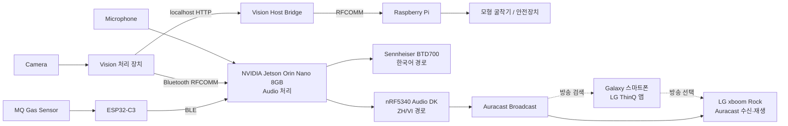

# 하드웨어 구성

## 전체 연결 구조

## 장치별 역할

| 장치 | 시스템 역할 | 연결 방식 |
|---|---|---|
| NVIDIA Jetson Orin Nano 8GB | Audio 처리, VAD/STT, 정규화, 번역, TTS, Fast Path, BLE Gas 수신, Audio routing | Microphone, BLE, Bluetooth, serial/Audio |
| nRF5340 Audio DK | 중국어·베트남어 Auracast 방송 | serial 설정 및 ZH/VI Audio |
| Sennheiser BTD700 | 한국어 Audio 출력 경로 | ALSA Audio |
| LG xboom Rock | 실제 시연의 Auracast Receiver 및 안전방송 수신·재생 장치 | Auracast 수신 |
| Galaxy 스마트폰 | 실제 시연에서 LG ThinQ 앱으로 Auracast 방송 검색·선택. 정확한 시연 모델은 특정하지 않음 | LG ThinQ 앱 |
| ESP32-C3 | MQ Gas Sensor 측정값 송신 | BLE |
| Raspberry Pi | 위험 이벤트 수신 및 GPIO 제어 | Bluetooth RFCOMM, BCM GPIO |
| Camera | 사람·굴착기 영상 입력 | Vision 장치 연결 |
| Microphone | 관리자 한국어 음성 입력 | Audio Jetson 연결 |

실제 시연에서는 Galaxy 스마트폰의 LG ThinQ 앱으로 방송을 검색·선택했으며, 방송 수신과 음성 재생은 LG xboom Rock이 담당했습니다.

## 코드에서 확인되는 Interface

- nRF5340 serial: `/dev/ttyACM0`, 115200 baud
- Vision/Audio/Raspberry Pi: Bluetooth RFCOMM channel 1
- ESP32-C3 Gas Sensor: BLE service/characteristic
- Vision Host Bridge: localhost port 8765, `POST /event`
- Audio/Vision Flask UI: port 5000
- Raspberry Pi: BCM GPIO 2, 3, 4, 14

Camera와 Microphone의 정확한 제품 모델, MQ Sensor의 세부 모델은 저장소에서 특정하지 않습니다.
