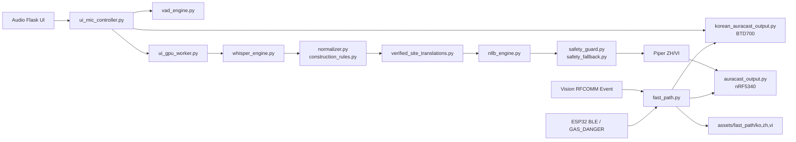
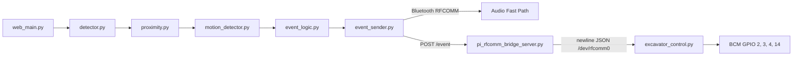

# 소프트웨어 구조

## Audio Safe Path와 Fast Path

Safe Path는 관리자 발화를 STT·정규화·번역·TTS로 처리합니다. Fast Path는 Vision/Gas event가 발생하면 Safe Path ZH/VI queue를 선점하고 사전 생성된 KO/ZH/VI WAV를 즉시 전달합니다.

## Vision과 장치 제어

## 외부 실행 구성

whisper-server/Whisper model, NLLB CTranslate2 model, Piper 실행 파일과 voice model은 실행 장비에 별도로 구성합니다. `integration/pi_rfcomm_bridge_server.py`는 Vision sender와 같은 loopback network context에서 실행되어야 하며 Host의 `rfcomm` 명령과 `/dev/rfcomm0` 접근 권한이 필요합니다.
