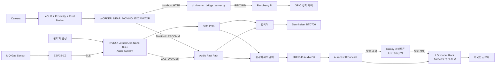

# SAYFE 전체 시스템 구조

SAYFE는 관리자 음성 Safe Path, Vision Fast Path, Gas Fast Path를 NVIDIA Jetson Orin Nano 8GB의 Audio 시스템에서 통합하고 언어별 출력 장치로 routing합니다.

## 데이터 경로 요약

| 경로 | 입력 | 핵심 처리 | 최종 출력 |
|---|---|---|---|
| Safe Path | 관리자 한국어 음성 | VAD, STT, 정규화, 번역, TTS | BTD700 또는 nRF5340 Auracast |
| Vision Fast Path | Camera 영상 | YOLO, 근접 판단, Pixel Motion, 위험 이벤트 | KO/ZH/VI 긴급 경고 + Raspberry Pi GPIO |
| Gas Fast Path | MQ 측정값 | ESP32-C3 BLE, Threshold, `GAS_DANGER` | KO/ZH/VI 긴급 경고 |

실제 시연에서는 Galaxy 스마트폰의 LG ThinQ 앱으로 Auracast 방송을 검색·선택했습니다. Galaxy는 별도의 SAYFE software module이나 방송 재생 장치가 아니며, Auracast 방송 수신과 음성 재생은 LG xboom Rock이 담당했습니다.
