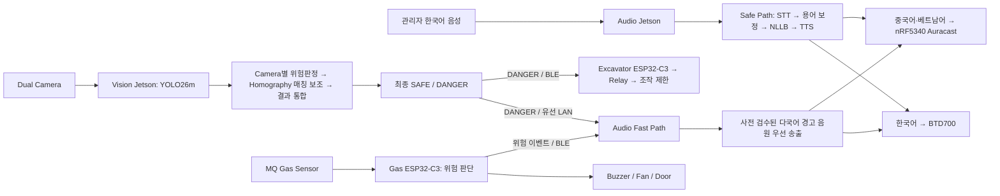

# SAYFE 전체 시스템 구조

최종 결선 시스템의 기준은 [메인 README](../README.md)입니다.

```mermaid
flowchart LR
    MIC[관리자 한국어 음성] --> AUDIO[Audio Jetson]
    AUDIO --> SAFE["Safe Path: STT → 용어 보정 → NLLB → TTS"]
    SAFE --> KO["한국어 → BTD700"]
    SAFE --> ZHVI["중국어·베트남어 → nRF5340 Auracast"]

    CAM[Dual Camera] --> VISION["Vision Jetson: YOLO26m"]
    VISION --> RISK["Camera별 위험판정 → Homography 매칭 보조 → 결과 통합"]
    RISK --> FINAL["최종 SAFE / DANGER"]
    FINAL -->|DANGER / 유선 LAN| FAST[Audio Fast Path]
    FINAL -->|DANGER / BLE| EX["Excavator ESP32-C3 → Relay → 조작 제한"]

    MQ[MQ Gas Sensor] --> GAS["Gas ESP32-C3: 위험 판단"]
    GAS --> ACT["Buzzer / Fan / Door"]
    GAS -->|위험 이벤트 / BLE| FAST
    FAST --> WARN[사전 검수된 다국어 경고 음원 우선 송출]
    WARN --> KO
    WARN --> ZHVI
```

Fast Path는 일반 안전방송보다 위험 경고를 우선 처리합니다. 굴착기는 위험상황이 해제된 뒤에도 안전 인터록을 유지하며, 관리자 확인 후 정상 조작으로 복귀합니다.
